

# Donatio Diagrams

## 1. Diagram Architettura Sistema

Il seguente diagramma illustra l'architettura complessiva del sistema Donatio, mostrando tutti i componenti principali e le loro interazioni. Questo fornisce una visione d'insieme dell'ecosistema completo.

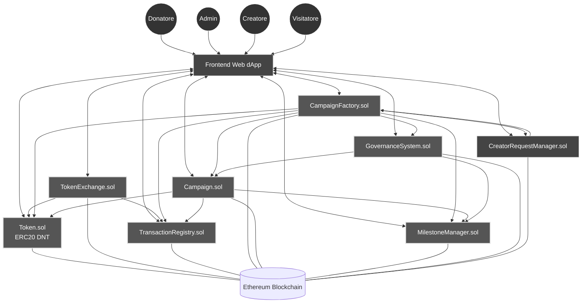
```mermaid
graph TD
    %% External Components
    Donor((Donatore))
    Admin((Admin))
    Creator((Creatore))
    Visitor((Visitatore))
    
    %% Frontend
    Frontend[Frontend Web dApp]
    
    %% Smart Contracts
    Token[Token.sol\nERC20 DNT]
    Exchange[TokenExchange.sol]
    Registry[TransactionRegistry.sol]
    Factory[CampaignFactory.sol]
    Campaign[Campaign.sol]
    MManager[MilestoneManager.sol]
    Governance[GovernanceSystem.sol]
    RequestManager[CreatorRequestManager.sol]
    
    %% Blockchain
    Ethereum[(Ethereum Blockchain)]
    
    %% User Connections
    Donor --> Frontend
    Admin --> Frontend
    Creator --> Frontend
    Visitor --> Frontend
    
    %% Frontend Connections
    Frontend <--> Token
    Frontend <--> Exchange
    Frontend <--> Registry
    Frontend <--> Factory
    Frontend <--> Campaign
    Frontend <--> MManager
    Frontend <--> Governance
    Frontend <--> RequestManager
    
    %% Contract Interactions (Primary)
    Exchange --> Token
    Exchange --> Registry
    Factory --> Token
    Factory --> Registry
    Factory --> MManager
    Factory --> RequestManager
    Factory --> Campaign
    Factory --> Governance
    Campaign --> Token
    Campaign --> Registry
    Campaign --> MManager
    
    %% Contract Interactions (Secondary)
    Governance --> Campaign
    Governance --> MManager
    RequestManager --> Factory
    
    %% Blockchain Connection
    Token --- Ethereum
    Exchange --- Ethereum
    Registry --- Ethereum
    Factory --- Ethereum
    Campaign --- Ethereum
    MManager --- Ethereum
    Governance --- Ethereum
    RequestManager --- Ethereum
    
    %% Subgraph Styling - Optimized for dark themes
    classDef core fill:#555555,stroke:#e0e0e0,stroke-width:2px,color:#ffffff;
    classDef auxiliary fill:#444444,stroke:#cccccc,stroke-width:1px,color:#ffffff;
    classDef actors fill:#333333,stroke:#ffffff,stroke-width:1px,color:#ffffff;
    
    class Token,Exchange,Registry,Factory,Campaign,MManager,Governance core;
    class RequestManager,Frontend auxiliary;
    class Donor,Admin,Creator,Visitor actors;
```

## 2. Diagram Relazione Contratti

Il seguente diagramma mostra le relazioni tra i vari contratti smart di Donatio, illustrando dipendenze, interfacce e flussi di dati principali.

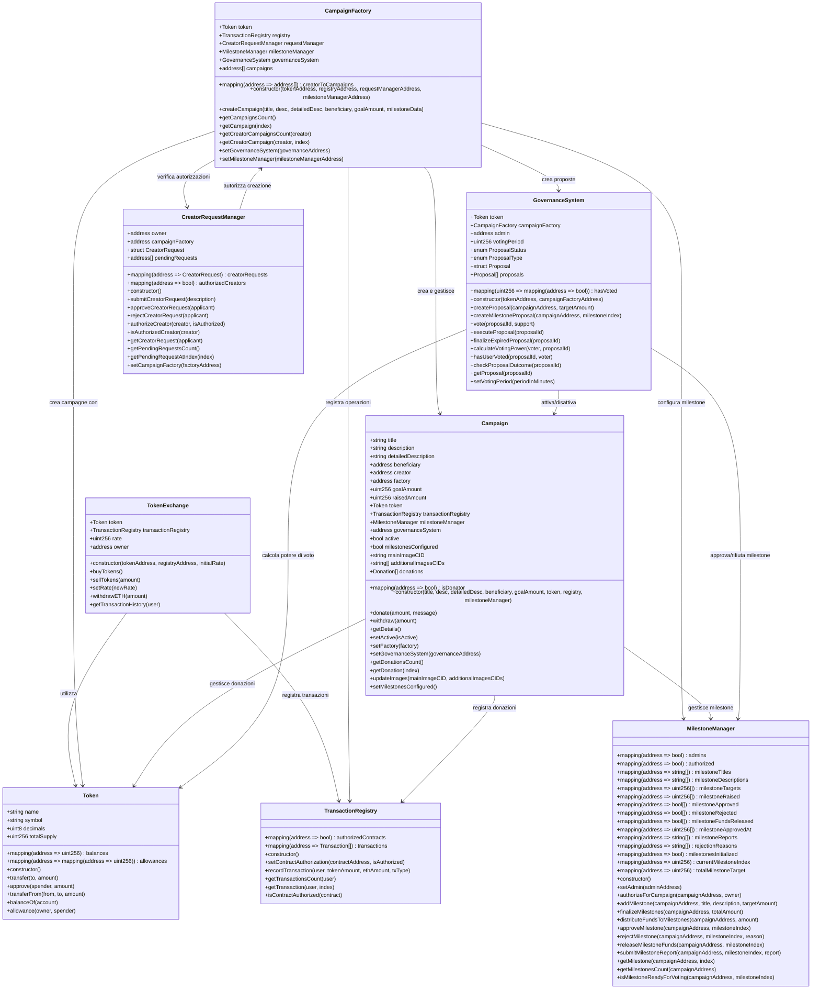
```mermaid
classDiagram
    %% Contratti principali
    class Token {
        +string name
        +string symbol
        +uint8 decimals
        +uint256 totalSupply
        +mapping(address => uint256) balances
        +mapping(address => mapping(address => uint256)) allowances
        +constructor()
        +transfer(to, amount)
        +approve(spender, amount)
        +transferFrom(from, to, amount)
        +balanceOf(account)
        +allowance(owner, spender)
    }
    
    class TokenExchange {
        +Token token
        +TransactionRegistry transactionRegistry
        +uint256 rate
        +address owner
        +constructor(tokenAddress, registryAddress, initialRate)
        +buyTokens()
        +sellTokens(amount)
        +setRate(newRate)
        +withdrawETH(amount)
        +getTransactionHistory(user)
    }
    
    class TransactionRegistry {
        +mapping(address => bool) authorizedContracts
        +mapping(address => Transaction[]) transactions
        +constructor()
        +setContractAuthorization(contractAddress, isAuthorized)
        +recordTransaction(user, tokenAmount, ethAmount, txType)
        +getTransactionsCount(user)
        +getTransaction(user, index)
        +isContractAuthorized(contract)
    }
    
    class CampaignFactory {
        +Token token
        +TransactionRegistry registry
        +CreatorRequestManager requestManager
        +MilestoneManager milestoneManager
        +GovernanceSystem governanceSystem
        +address[] campaigns
        +mapping(address => address[]) creatorToCampaigns
        +constructor(tokenAddress, registryAddress, requestManagerAddress, milestoneManagerAddress)
        +createCampaign(title, desc, detailedDesc, beneficiary, goalAmount, milestoneData)
        +getCampaignsCount()
        +getCampaign(index)
        +getCreatorCampaignsCount(creator)
        +getCreatorCampaign(creator, index)
        +setGovernanceSystem(governanceAddress)
        +setMilestoneManager(milestoneManagerAddress)
    }
    
    class Campaign {
        +string title
        +string description
        +string detailedDescription
        +address beneficiary
        +address creator
        +address factory
        +uint256 goalAmount
        +uint256 raisedAmount
        +Token token
        +TransactionRegistry transactionRegistry
        +MilestoneManager milestoneManager
        +address governanceSystem
        +bool active
        +bool milestonesConfigured
        +string mainImageCID
        +string[] additionalImagesCIDs
        +Donation[] donations
        +mapping(address => bool) isDonator
        +constructor(title, desc, detailedDesc, beneficiary, goalAmount, token, registry, milestoneManager)
        +donate(amount, message)
        +withdraw(amount)
        +getDetails()
        +setActive(isActive)
        +setFactory(factory)
        +setGovernanceSystem(governanceAddress)
        +getDonationsCount()
        +getDonation(index)
        +updateImages(mainImageCID, additionalImagesCIDs)
        +setMilestonesConfigured()
    }
    
    class MilestoneManager {
        +mapping(address => bool) admins
        +mapping(address => bool) authorized
        +mapping(address => string[]) milestoneTitles
        +mapping(address => string[]) milestoneDescriptions
        +mapping(address => uint256[]) milestoneTargets
        +mapping(address => uint256[]) milestoneRaised
        +mapping(address => bool[]) milestoneApproved
        +mapping(address => bool[]) milestoneRejected
        +mapping(address => bool[]) milestoneFundsReleased
        +mapping(address => uint256[]) milestoneApprovedAt
        +mapping(address => string[]) milestoneReports
        +mapping(address => string[]) rejectionReasons
        +mapping(address => bool) milestonesInitialized
        +mapping(address => uint256) currentMilestoneIndex
        +mapping(address => uint256) totalMilestoneTarget
        +constructor()
        +setAdmin(adminAddress)
        +authorizeForCampaign(campaignAddress, owner)
        +addMilestone(campaignAddress, title, description, targetAmount)
        +finalizeMilestones(campaignAddress, totalAmount)
        +distributeFundsToMilestones(campaignAddress, amount)
        +approveMilestone(campaignAddress, milestoneIndex)
        +rejectMilestone(campaignAddress, milestoneIndex, reason)
        +releaseMilestoneFunds(campaignAddress, milestoneIndex)
        +submitMilestoneReport(campaignAddress, milestoneIndex, report)
        +getMilestone(campaignAddress, index)
        +getMilestonesCount(campaignAddress)
        +isMilestoneReadyForVoting(campaignAddress, milestoneIndex)
    }
    
    class GovernanceSystem {
        +Token token
        +CampaignFactory campaignFactory
        +address admin
        +uint256 votingPeriod
        +enum ProposalStatus
        +enum ProposalType
        +struct Proposal
        +Proposal[] proposals
        +mapping(uint256 => mapping(address => bool)) hasVoted
        +constructor(tokenAddress, campaignFactoryAddress)
        +createProposal(campaignAddress, targetAmount)
        +createMilestoneProposal(campaignAddress, milestoneIndex)
        +vote(proposalId, support)
        +executeProposal(proposalId)
        +finalizeExpiredProposal(proposalId)
        +calculateVotingPower(voter, proposalId)
        +hasUserVoted(proposalId, voter)
        +checkProposalOutcome(proposalId)
        +getProposal(proposalId)
        +setVotingPeriod(periodInMinutes)
    }
    
    class CreatorRequestManager {
        +address owner
        +address campaignFactory
        +struct CreatorRequest
        +mapping(address => CreatorRequest) creatorRequests
        +mapping(address => bool) authorizedCreators
        +address[] pendingRequests
        +constructor()
        +submitCreatorRequest(description)
        +approveCreatorRequest(applicant)
        +rejectCreatorRequest(applicant)
        +authorizeCreator(creator, isAuthorized)
        +isAuthorizedCreator(creator)
        +getCreatorRequest(applicant)
        +getPendingRequestsCount()
        +getPendingRequestAtIndex(index)
        +setCampaignFactory(factoryAddress)
    }
    
    %% Relazioni principali
    TokenExchange --> Token : utilizza
    TokenExchange --> TransactionRegistry : registra transazioni
    
    CampaignFactory --> Token : crea campagne con
    CampaignFactory --> TransactionRegistry : registra operazioni
    CampaignFactory --> CreatorRequestManager : verifica autorizzazioni
    CampaignFactory --> MilestoneManager : configura milestone
    CampaignFactory --> GovernanceSystem : crea proposte
    CampaignFactory --> Campaign : crea e gestisce
    
    Campaign --> Token : gestisce donazioni
    Campaign --> TransactionRegistry : registra donazioni
    Campaign --> MilestoneManager : gestisce milestone
    
    GovernanceSystem --> Token : calcola potere di voto
    GovernanceSystem --> Campaign : attiva/disattiva
    GovernanceSystem --> MilestoneManager : approva/rifiuta milestone
    
    CreatorRequestManager --> CampaignFactory : autorizza creazione
```

## 3. Use Case Diagram

Il seguente diagramma illustra le principali funzionalità del sistema Donatio e come i diversi attori interagiscono con esse.

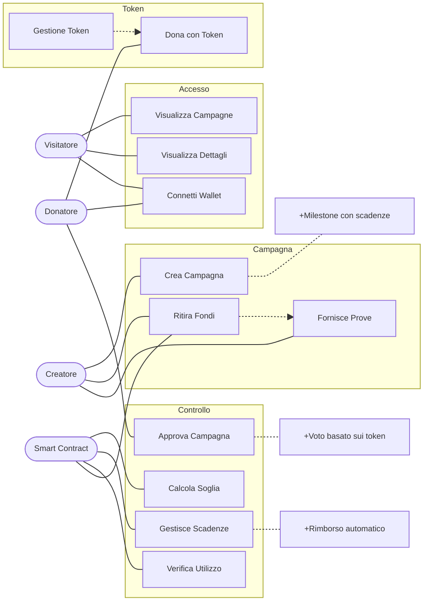
```mermaid
%%{init: { 
  'themeVariables': {'fontSize': '10px'},
  'flowchart': {'diagramPadding': 4, 'nodeSpacing': 5, 'rankSpacing': 15, 'curve': 'basis'},
  'themeCSS': 'svg { transform: scale(0.6); transform-origin: top left; }',
  'fit': true
}}%%

flowchart LR
    %% Attori (forma più compatta)
    Visitatore(["Visitatore"])
    Donatore(["Donatore"])
    Creator(["Creatore"])
    SmartContract(["Smart Contract"])
    
    %% Gruppi funzionali con casi d'uso come pill (più compatti)
    subgraph Token["Token"]
        direction TB
        GestioneToken["Gestione Token"]
        DonaToken["Dona con Token"]
    end
    
    subgraph Accesso["Accesso"]
        direction TB
        VisualizzaCampagne["Visualizza Campagne"]
        VisualizzaDettagli["Visualizza Dettagli"]
        ConnettiWallet["Connetti Wallet"]
    end
    
    subgraph Controllo["Controllo"]
        direction TB
        ApprovaCampagna["Approva Campagna"]
        CalcolaSoglia["Calcola Soglia"]
        GestisceScadenze["Gestisce Scadenze"]
        VerificaUtilizzo["Verifica Utilizzo"]
    end
    
    subgraph Campagna["Campagna"]
        direction TB
        CreaCampagna["Crea Campagna"]
        RitiraFondi["Ritira Fondi"]
        FornisceProve["Fornisce Prove"]
    end
    
    %% Note informative (più piccole) 
    ApprovalNote["+Voto basato sui token"]
    RefundNote["+Rimborso automatico"]
    MilestoneNote["+Milestone con scadenze"]
    
    %% Collegamenti attori-casi d'uso
    Visitatore --- VisualizzaCampagne
    Visitatore --- VisualizzaDettagli
    Visitatore --- ConnettiWallet
    
    Donatore --- ConnettiWallet
    Donatore --- DonaToken
    Donatore --- ApprovaCampagna
    
    SmartContract --- CalcolaSoglia
    SmartContract --- GestisceScadenze
    SmartContract --- VerificaUtilizzo
    SmartContract --- RitiraFondi
    
    Creator --- CreaCampagna
    Creator --- RitiraFondi
    Creator --- FornisceProve
    
    %% Collegamenti per inclusione (linee più sottili)
    GestioneToken -.-> DonaToken
    RitiraFondi -.-> FornisceProve
    
    %% Collegamenti note
    ApprovaCampagna -.- ApprovalNote
    GestisceScadenze -.- RefundNote
    CreaCampagna -.- MilestoneNote
```

## 3.1. Use Case Diagram: Sistema Token e Exchange

Il seguente diagramma illustra le funzionalità specifiche del sistema di token e dell'exchange nel progetto Donatio, mostrando come gli utenti interagiscono con le varie funzionalità di compravendita e gestione dei token.

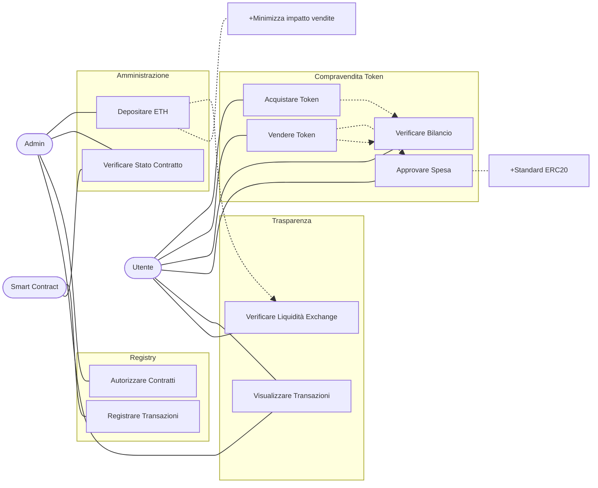
```mermaid
%%{init: { 
  'themeVariables': {'fontSize': '10px'},
  'flowchart': {'diagramPadding': 4, 'nodeSpacing': 5, 'rankSpacing': 15, 'curve': 'basis'},
  'themeCSS': 'svg { transform: scale(0.6); transform-origin: top left; }',
  'fit': true
}}%%

flowchart LR
    %% Attori (forma più compatta)
    Utente(["Utente"])
    Admin(["Admin"])
    SmartContract(["Smart Contract"])
    
    %% Gruppi funzionali con casi d'uso
    subgraph Compravendita["Compravendita Token"]
        direction TB
        AcquistareToken["Acquistare Token"]
        VendereToken["Vendere Token"]
        VerificareBilancio["Verificare Bilancio"]
        ApprovareSpesa["Approvare Spesa"]
    end
    
    subgraph Trasparenza["Trasparenza"]
        direction TB
        VisualizzareStorico["Visualizzare Transazioni"]
        VerificareLiquidità["Verificare Liquidità Exchange"]
    end
    
    subgraph Amministrazione["Amministrazione"]
        direction TB
        DepositareETH["Depositare ETH"]
        VerificareContratto["Verificare Stato Contratto"]
    end
    
    subgraph Registry["Registry"]
        direction TB
        RegistrareTransazioni["Registrare Transazioni"]
        AutorizzareContratti["Autorizzare Contratti"]
    end
    
    %% Note informative
    ApproveNote["+Standard ERC20"]
    LiquiditàNote["+Minimizza impatto vendite"]
    
    %% Collegamenti attori-casi d'uso
    Utente --- AcquistareToken
    Utente --- VendereToken
    Utente --- VerificareBilancio
    Utente --- ApprovareSpesa
    Utente --- VisualizzareStorico
    Utente --- VerificareLiquidità
    
    Admin --- DepositareETH
    Admin --- VerificareContratto
    Admin --- AutorizzareContratti
    Admin --- VisualizzareStorico
    
    SmartContract --- RegistrareTransazioni
    SmartContract --- VerificareContratto
    
    %% Collegamenti per inclusione (linee più sottili)
    AcquistareToken -.-> VerificareBilancio
    VendereToken -.-> ApprovareSpesa
    VendereToken -.-> VerificareBilancio
    DepositareETH -.-> VerificareLiquidità
    
    %% Collegamenti note
    ApprovareSpesa -.- ApproveNote
    DepositareETH -.- LiquiditàNote
```

## 3.2 Use Case Diagram: Gestione Campagne

Il seguente diagramma illustra le funzionalità specifiche del sistema di gestione campagne nel progetto Donatio, mostrando come i vari attori interagiscono con le funzionalità di creazione, donazione e gestione delle campagne di raccolta fondi.

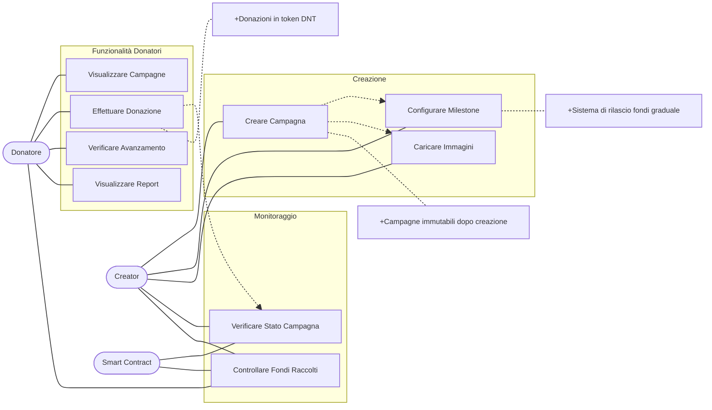
```mermaid
%%{init: { 
  'themeVariables': {'fontSize': '10px'},
  'flowchart': {'diagramPadding': 4, 'nodeSpacing': 5, 'rankSpacing': 15, 'curve': 'basis'},
  'themeCSS': 'svg { transform: scale(0.6); transform-origin: top left; }',
  'fit': true
}}%%

flowchart LR
    %% Attori (forma più compatta)
    Creator(["Creator"])
    Donatore(["Donatore"])
    SmartContract(["Smart Contract"])
    
    %% Gruppi funzionali con casi d'uso
    subgraph Creazione["Creazione"]
        direction TB
        CreareCampagna["Creare Campagna"]
        ConfigurareMilestone["Configurare Milestone"]
        UploadImmagini["Caricare Immagini"]
    end
    
    subgraph Donazioni["Funzionalità Donatori"]
        direction TB
        VisualizzareCampagne["Visualizzare Campagne"]
        EffettuareDonazione["Effettuare Donazione"]
        VerificareMilestone["Verificare Avanzamento"]
        VisualizzareReport["Visualizzare Report"]
    end
    
    subgraph Monitoraggio["Monitoraggio"]
        direction TB
        VerificareStato["Verificare Stato Campagna"]
        ControllareRaccolto["Controllare Fondi Raccolti"]
    end
    
    %% Note informative
    MilestoneNote["+Sistema di rilascio fondi graduale"]
    DonazioneNote["+Donazioni in token DNT"]
    ImmutabileNote["+Campagne immutabili dopo creazione"]
    
    %% Collegamenti attori-casi d'uso
    Creator --- CreareCampagna
    Creator --- ConfigurareMilestone
    Creator --- UploadImmagini
    Creator --- VerificareStato
    Creator --- ControllareRaccolto
    
    Donatore --- VisualizzareCampagne
    Donatore --- EffettuareDonazione
    Donatore --- VerificareMilestone
    Donatore --- VisualizzareReport
    Donatore --- ControllareRaccolto
    
    SmartContract --- VerificareStato
    SmartContract --- ControllareRaccolto
    
    %% Collegamenti per inclusione (linee più sottili)
    CreareCampagna -.-> ConfigurareMilestone
    CreareCampagna -.-> UploadImmagini
    EffettuareDonazione -.-> VerificareStato
    
    %% Collegamenti note
    ConfigurareMilestone -.- MilestoneNote
    EffettuareDonazione -.- DonazioneNote
    CreareCampagna -.- ImmutabileNote
```

## 3.3. Use Case Diagram: Sistema Milestone

Il seguente diagramma illustra le funzionalità specifiche del sistema di gestione delle milestone nel progetto Donatio, evidenziando i meccanismi di votazione, approvazione e rilascio progressivo dei fondi.

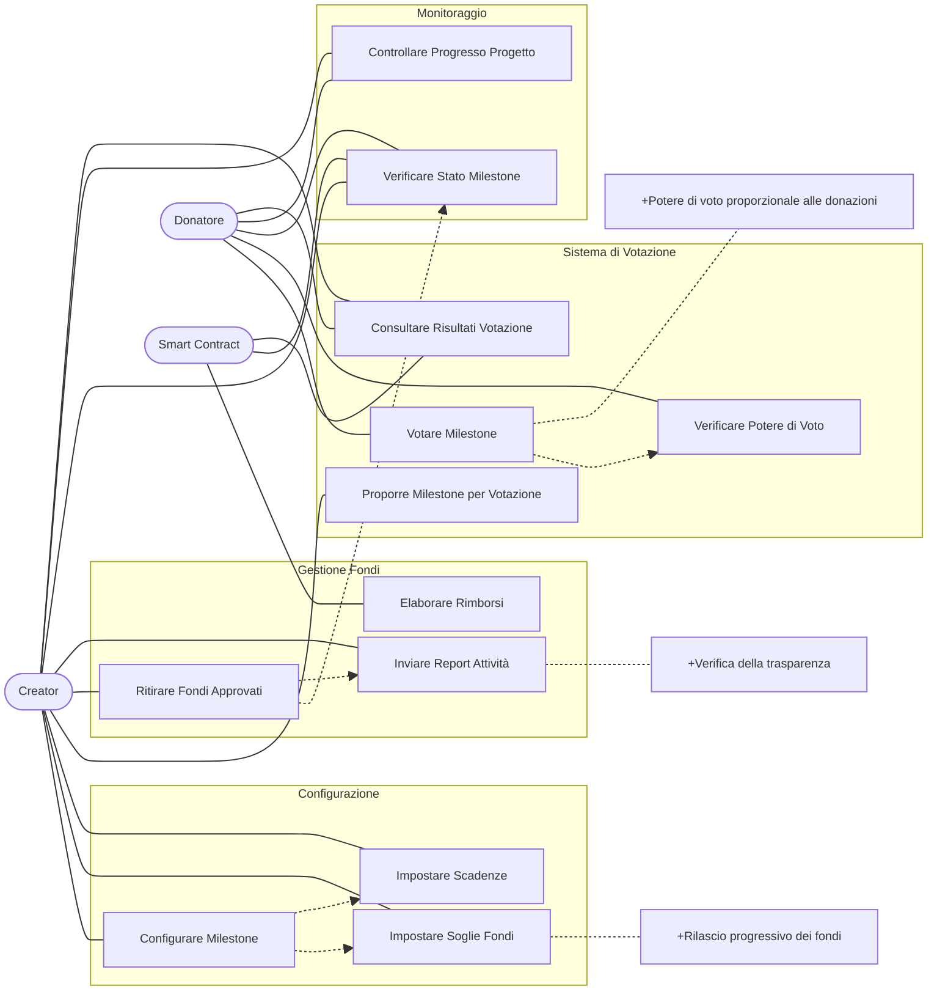
```mermaid
%%{init: { 
  'themeVariables': {'fontSize': '10px'},
  'flowchart': {'diagramPadding': 4, 'nodeSpacing': 5, 'rankSpacing': 15, 'curve': 'basis'},
  'themeCSS': 'svg { transform: scale(0.6); transform-origin: top left; }',
  'fit': true
}}%%

flowchart LR
    %% Attori (forma più compatta)
    Creator(["Creator"])
    Donatore(["Donatore"])
    SmartContract(["Smart Contract"])
    
    %% Gruppi funzionali con casi d'uso
    subgraph Configurazione["Configurazione"]
        direction TB
        ConfigurareMilestone["Configurare Milestone"]
        ImpostareSoglie["Impostare Soglie Fondi"]
        ImpostareScadenze["Impostare Scadenze"]
    end
    
    subgraph Votazione["Sistema di Votazione"]
        direction TB
        ProporsiPerVotazione["Proporre Milestone per Votazione"]
        VotareMilestone["Votare Milestone"]
        VerificarePotereVoto["Verificare Potere di Voto"]
        ConsultareRisultati["Consultare Risultati Votazione"]
    end
    
    subgraph GestioneFondi["Gestione Fondi"]
        direction TB
        RitirareFondi["Ritirare Fondi Approvati"]
        InviareReport["Inviare Report Attività"]
        ElaborareRimborsi["Elaborare Rimborsi"]
    end
    
    subgraph Tracking["Monitoraggio"]
        direction TB
        VerificareStatoMilestone["Verificare Stato Milestone"]
        ControllareProgressoProgetto["Controllare Progresso Progetto"]
    end
    
    %% Note informative
    SoglieNote["+Rilascio progressivo dei fondi"]
    VotazioneNote["+Potere di voto proporzionale alle donazioni"]
    ReportNote["+Verifica della trasparenza"]
    
    %% Collegamenti attori-casi d'uso
    Creator --- ConfigurareMilestone
    Creator --- ImpostareSoglie
    Creator --- ImpostareScadenze
    Creator --- ProporsiPerVotazione
    Creator --- RitirareFondi
    Creator --- InviareReport
    Creator --- VerificareStatoMilestone
    Creator --- ControllareProgressoProgetto
    Creator --- ConsultareRisultati
    
    Donatore --- VotareMilestone
    Donatore --- VerificarePotereVoto
    Donatore --- VerificareStatoMilestone
    Donatore --- ControllareProgressoProgetto
    Donatore --- ConsultareRisultati
    
    SmartContract --- ElaborareRimborsi
    SmartContract --- VerificareStatoMilestone
    SmartContract --- ConsultareRisultati
    
    %% Collegamenti per inclusione (linee più sottili)
    ConfigurareMilestone -.-> ImpostareSoglie
    ConfigurareMilestone -.-> ImpostareScadenze
    VotareMilestone -.-> VerificarePotereVoto
    RitirareFondi -.-> VerificareStatoMilestone
    RitirareFondi -.-> InviareReport
    
    %% Collegamenti note
    ImpostareSoglie -.- SoglieNote
    VotareMilestone -.- VotazioneNote
    InviareReport -.- ReportNote
```

## 3.4. Use Case Diagram: Autorizzazione Creatori

Il seguente diagramma illustra le funzionalità del sistema di autorizzazione dei creatori in Donatio, mostrando il processo di richiesta, approvazione e gestione degli account con privilegi di creazione campagne.

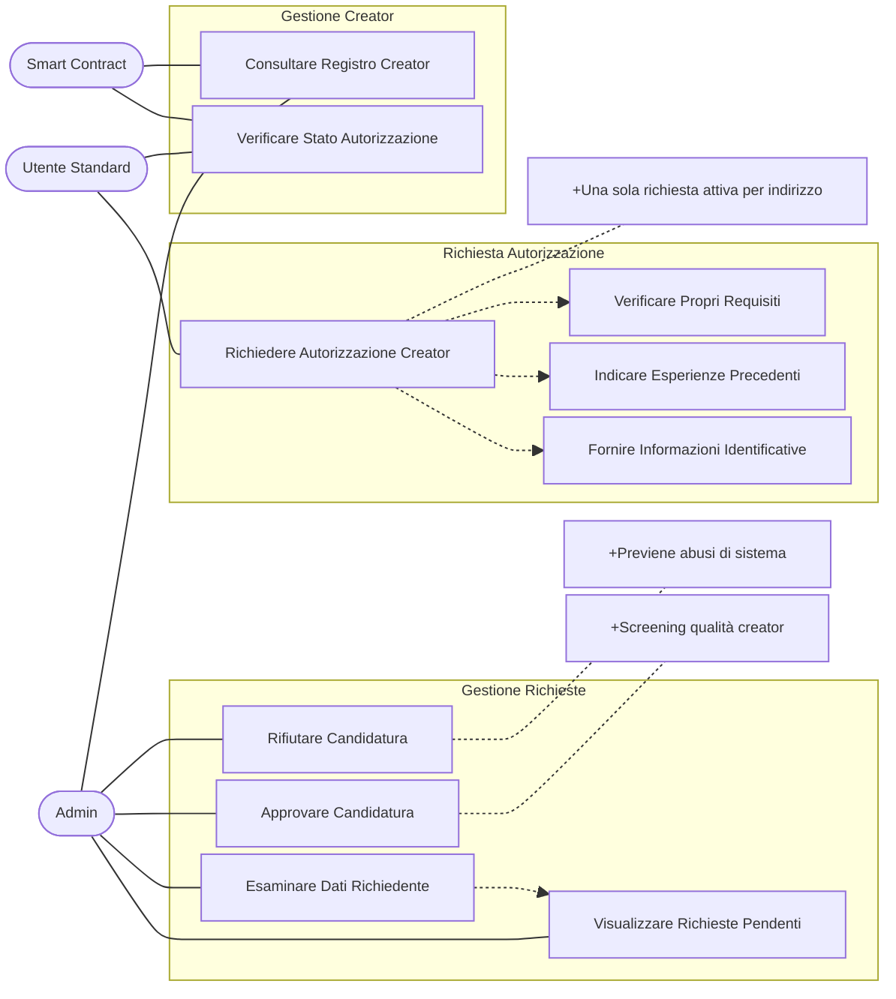
```mermaid
%%{init: { 
  'themeVariables': {'fontSize': '10px'},
  'flowchart': {'diagramPadding': 4, 'nodeSpacing': 5, 'rankSpacing': 15, 'curve': 'basis'},
  'themeCSS': 'svg { transform: scale(0.6); transform-origin: top left; }',
  'fit': true
}}%%

flowchart LR
    %% Attori (forma più compatta)
    Utente(["Utente Standard"])
    Admin(["Admin"])
    SmartContract(["Smart Contract"])
    
    %% Gruppi funzionali con casi d'uso
    subgraph Richiesta["Richiesta Autorizzazione"]
        direction TB
        RichiederaAutorizzazione["Richiedere Autorizzazione Creator"]
        FornireInformazioni["Fornire Informazioni Identificative"]
        IndicareEsperienze["Indicare Esperienze Precedenti"]
        VerificareRequisiti["Verificare Propri Requisiti"]
    end
    
    subgraph Approvazione["Gestione Richieste"]
        direction TB
        VisualizzareRichieste["Visualizzare Richieste Pendenti"]
        EsaminareDati["Esaminare Dati Richiedente"]
        ApprovareCandidatura["Approvare Candidatura"]
        RifiutareCandidatura["Rifiutare Candidatura"]
    end
    
    subgraph Gestione["Gestione Creator"]
        direction TB
        VerificareStato["Verificare Stato Autorizzazione"]
        ConsultareRegistro["Consultare Registro Creator"]
    end
    
    %% Note informative
    VerificaNote["+Screening qualità creator"]
    RifiutoNote["+Previene abusi di sistema"]
    RichiestaNote["+Una sola richiesta attiva per indirizzo"]
    
    %% Collegamenti attori-casi d'uso
    Utente --- RichiederaAutorizzazione
    Utente --- VerificareStato
    
    Admin --- VisualizzareRichieste
    Admin --- EsaminareDati
    Admin --- ApprovareCandidatura
    Admin --- RifiutareCandidatura
    Admin --- ConsultareRegistro
    
    SmartContract --- VerificareStato
    SmartContract --- ConsultareRegistro
    
    %% Collegamenti per inclusione (linee più sottili)
    RichiederaAutorizzazione -.-> FornireInformazioni
    RichiederaAutorizzazione -.-> IndicareEsperienze
    RichiederaAutorizzazione -.-> VerificareRequisiti
    EsaminareDati -.-> VisualizzareRichieste
    
    %% Collegamenti note
    ApprovareCandidatura -.- VerificaNote
    RifiutareCandidatura -.- RifiutoNote
    RichiederaAutorizzazione -.- RichiestaNote
```

## 3.5. Use Case Diagram: Sistema di Governance

Il seguente diagramma illustra le funzionalità del sistema di governance decentralizzata in Donatio, mostrando i processi di creazione e gestione delle proposte, votazione e implementazione delle decisioni collettive.

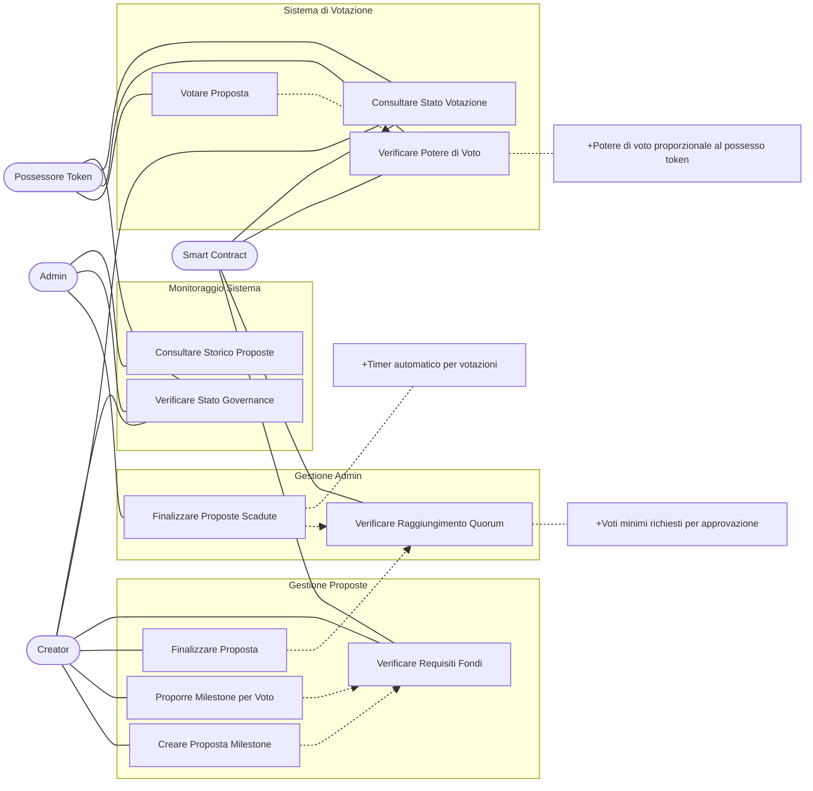
```mermaid
%%{init: { 
  'themeVariables': {'fontSize': '10px'},
  'flowchart': {'diagramPadding': 4, 'nodeSpacing': 5, 'rankSpacing': 15, 'curve': 'basis'},
  'themeCSS': 'svg { transform: scale(0.6); transform-origin: top left; }',
  'fit': true
}}%%

flowchart LR
    %% Attori (forma più compatta)
    PossessoreToken(["Possessore Token"])
    Creator(["Creator"])
    Admin(["Admin"])
    SmartContract(["Smart Contract"])
    
    %% Gruppi funzionali con casi d'uso
    subgraph ProposteCreator["Gestione Proposte"]
        direction TB
        CreareProposta["Creare Proposta Milestone"]
        ProporsiPerVotazione["Proporre Milestone per Voto"]
        FinalizzareProposta["Finalizzare Proposta"]
        VerificareRequisitiFondi["Verificare Requisiti Fondi"]
    end
    
    subgraph Votazione["Sistema di Votazione"]
        direction TB
        VotareProposte["Votare Proposta"]
        VerificarePotereVoto["Verificare Potere di Voto"]
        ConsultareVotazione["Consultare Stato Votazione"]
    end
    
    subgraph Finalizzazione["Gestione Admin"]
        direction TB
        FinalizzareProposteScadute["Finalizzare Proposte Scadute"]
        VerificareQuorum["Verificare Raggiungimento Quorum"]
    end
    
    subgraph Monitoraggio["Monitoraggio Sistema"]
        direction TB
        VerificareStatoGovernance["Verificare Stato Governance"]
        ConsultareStorico["Consultare Storico Proposte"]
    end
    
    %% Note informative
    VotoNote["+Potere di voto proporzionale al possesso token"]
    ScadenzaNote["+Timer automatico per votazioni"]
    QuorumNote["+Voti minimi richiesti per approvazione"]
    
    %% Collegamenti attori-casi d'uso
    PossessoreToken --- VotareProposte
    PossessoreToken --- VerificarePotereVoto
    PossessoreToken --- ConsultareVotazione
    PossessoreToken --- VerificareStatoGovernance
    
    Creator --- CreareProposta
    Creator --- ProporsiPerVotazione
    Creator --- FinalizzareProposta
    Creator --- VerificareRequisitiFondi
    Creator --- ConsultareVotazione
    Creator --- VerificareStatoGovernance
    
    Admin --- FinalizzareProposteScadute
    Admin --- VerificareStatoGovernance
    Admin --- ConsultareStorico
    
    SmartContract --- VerificareRequisitiFondi
    SmartContract --- VerificarePotereVoto
    SmartContract --- VerificareQuorum
    SmartContract --- ConsultareVotazione
    
    %% Collegamenti per inclusione (linee più sottili)
    CreareProposta -.-> VerificareRequisitiFondi
    ProporsiPerVotazione -.-> VerificareRequisitiFondi
    VotareProposte -.-> VerificarePotereVoto
    FinalizzareProposta -.-> VerificareQuorum
    FinalizzareProposteScadute -.-> VerificareQuorum
    
    %% Collegamenti note
    VerificarePotereVoto -.- VotoNote
    FinalizzareProposteScadute -.- ScadenzaNote
    VerificareQuorum -.- QuorumNote
```

## 4. Sequence Diagram per Token Exchange

Il seguente diagramma illustra il flusso completo per l'acquisto e la vendita di token DNT, mostrando le interazioni tra gli attori e i componenti del sistema.

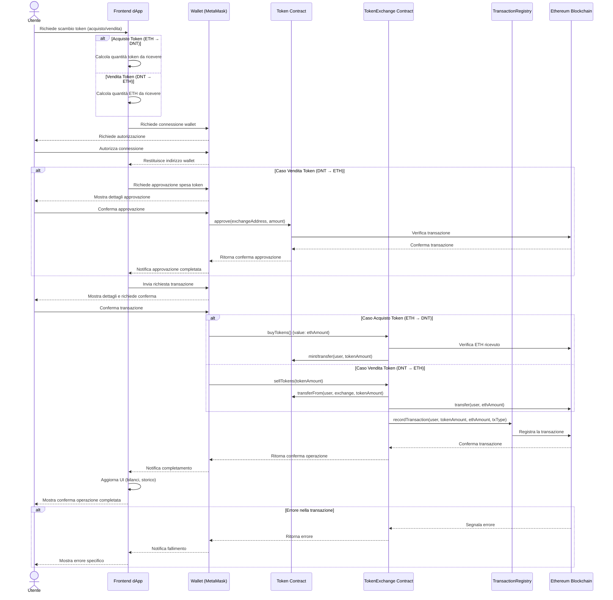
```mermaid
sequenceDiagram
    actor User as Utente
    participant Frontend as Frontend dApp
    participant Wallet as Wallet (MetaMask)
    participant Token as Token Contract
    participant Exchange as TokenExchange Contract
    participant Registry as TransactionRegistry
    participant Blockchain as Ethereum Blockchain
    
    User->>Frontend: Richiede scambio token (acquisto/vendita)
    
    alt Acquisto Token (ETH → DNT)
        Frontend->>Frontend: Calcola quantità token da ricevere
    else Vendita Token (DNT → ETH)
        Frontend->>Frontend: Calcola quantità ETH da ricevere
    end
    
    Frontend->>Wallet: Richiede connessione wallet
    Wallet-->>User: Richiede autorizzazione
    User->>Wallet: Autorizza connessione
    Wallet-->>Frontend: Restituisce indirizzo wallet
    
    alt Caso Vendita Token (DNT → ETH)
        Frontend->>Wallet: Richiede approvazione spesa token
        Wallet-->>User: Mostra dettagli approvazione
        User->>Wallet: Conferma approvazione
        Wallet->>Token: approve(exchangeAddress, amount)
        Token->>Blockchain: Verifica transazione
        Blockchain-->>Token: Conferma transazione
        Token-->>Wallet: Ritorna conferma approvazione
        Wallet-->>Frontend: Notifica approvazione completata
    end
    
    Frontend->>Wallet: Invia richiesta transazione
    Wallet-->>User: Mostra dettagli e richiede conferma
    User->>Wallet: Conferma transazione
    
    alt Caso Acquisto Token (ETH → DNT)
        Wallet->>Exchange: buyTokens() {value: ethAmount}
        Exchange->>Blockchain: Verifica ETH ricevuto
        Exchange->>Token: mint/transfer(user, tokenAmount)
    else Caso Vendita Token (DNT → ETH)
        Wallet->>Exchange: sellTokens(tokenAmount)
        Exchange->>Token: transferFrom(user, exchange, tokenAmount)
        Exchange->>Blockchain: transfer(user, ethAmount) 
    end
    
    Exchange->>Registry: recordTransaction(user, tokenAmount, ethAmount, txType)
    Registry->>Blockchain: Registra la transazione
    Blockchain-->>Exchange: Conferma transazione
    Exchange-->>Wallet: Ritorna conferma operazione
    Wallet-->>Frontend: Notifica completamento
    
    Frontend->>Frontend: Aggiorna UI (bilanci, storico)
    Frontend-->>User: Mostra conferma operazione completata
    
    alt Errore nella transazione
        Blockchain-->>Exchange: Segnala errore
        Exchange-->>Wallet: Ritorna errore
        Wallet-->>Frontend: Notifica fallimento
        Frontend-->>User: Mostra errore specifico
    end
```
## 5. Sequence Diagram per Creazione Campagna

Il seguente diagramma illustra il processo completo di creazione di una nuova campagna di raccolta fondi nel sistema Donatio, dalla richiesta iniziale dell'utente fino alla registrazione nella blockchain.

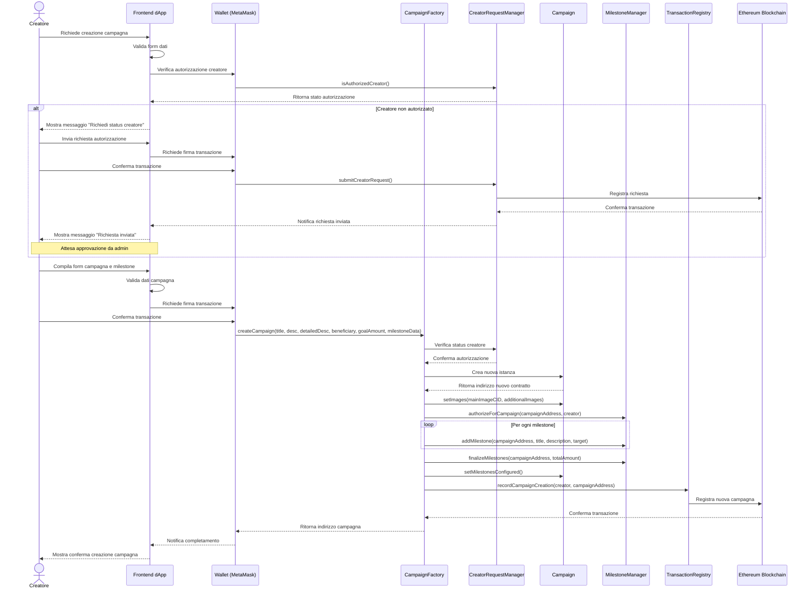
```mermaid
sequenceDiagram
    actor Creator as Creatore
    participant Frontend as Frontend dApp
    participant Wallet as Wallet (MetaMask)
    participant Factory as CampaignFactory
    participant RequestMgr as CreatorRequestManager
    participant Campaign as Campaign
    participant MilestoneMgr as MilestoneManager
    participant Registry as TransactionRegistry
    participant Blockchain as Ethereum Blockchain
    
    Creator->>Frontend: Richiede creazione campagna
    Frontend->>Frontend: Valida form dati
    Frontend->>Wallet: Verifica autorizzazione creatore
    Wallet->>RequestMgr: isAuthorizedCreator()
    RequestMgr-->>Frontend: Ritorna stato autorizzazione
    
    alt Creatore non autorizzato
        Frontend-->>Creator: Mostra messaggio "Richiedi status creatore"
        Creator->>Frontend: Invia richiesta autorizzazione
        Frontend->>Wallet: Richiede firma transazione
        Creator->>Wallet: Conferma transazione
        Wallet->>RequestMgr: submitCreatorRequest()
        RequestMgr->>Blockchain: Registra richiesta
        Blockchain-->>RequestMgr: Conferma transazione
        RequestMgr-->>Frontend: Notifica richiesta inviata
        Frontend-->>Creator: Mostra messaggio "Richiesta inviata"
        Note over Creator,Frontend: Attesa approvazione da admin
    end
    
    Creator->>Frontend: Compila form campagna e milestone
    Frontend->>Frontend: Valida dati campagna
    Frontend->>Wallet: Richiede firma transazione
    Creator->>Wallet: Conferma transazione
    Wallet->>Factory: createCampaign(title, desc, detailedDesc, beneficiary, goalAmount, milestoneData)
    Factory->>RequestMgr: Verifica status creatore
    RequestMgr-->>Factory: Conferma autorizzazione
    
    Factory->>Campaign: Crea nuova istanza
    Campaign-->>Factory: Ritorna indirizzo nuovo contratto
    Factory->>Campaign: setImages(mainImageCID, additionalImages)
    
    Factory->>MilestoneMgr: authorizeForCampaign(campaignAddress, creator)
    
    loop Per ogni milestone
        Factory->>MilestoneMgr: addMilestone(campaignAddress, title, description, target)
    end
    
    Factory->>MilestoneMgr: finalizeMilestones(campaignAddress, totalAmount)
    Factory->>Campaign: setMilestonesConfigured()
    
    Factory->>Registry: recordCampaignCreation(creator, campaignAddress)
    Registry->>Blockchain: Registra nuova campagna
    
    Blockchain-->>Factory: Conferma transazione
    Factory-->>Wallet: Ritorna indirizzo campagna
    Wallet-->>Frontend: Notifica completamento
    Frontend-->>Creator: Mostra conferma creazione campagna
```

## 6. Sequence Diagram per Processo di Donazione

Il seguente diagramma illustra il flusso completo del processo di donazione a una campagna nel sistema Donatio, mostrando tutte le interazioni tra gli attori e i contratti coinvolti.

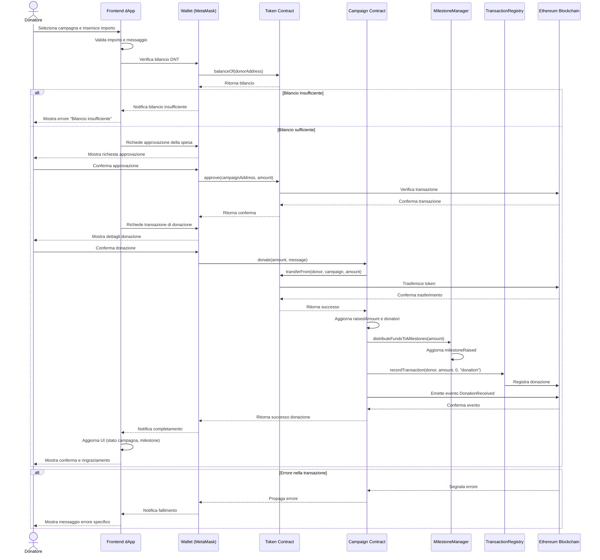
```mermaid
sequenceDiagram
    actor Donor as Donatore
    participant Frontend as Frontend dApp
    participant Wallet as Wallet (MetaMask)
    participant Token as Token Contract
    participant Campaign as Campaign Contract
    participant MManager as MilestoneManager
    participant Registry as TransactionRegistry
    participant Blockchain as Ethereum Blockchain
    
    Donor->>Frontend: Seleziona campagna e inserisce importo
    Frontend->>Frontend: Valida importo e messaggio
    Frontend->>Wallet: Verifica bilancio DNT
    Wallet->>Token: balanceOf(donorAddress)
    Token-->>Wallet: Ritorna bilancio
    
    alt Bilancio insufficiente
        Wallet-->>Frontend: Notifica bilancio insufficiente
        Frontend-->>Donor: Mostra errore "Bilancio insufficiente"
    else Bilancio sufficiente
        Frontend->>Wallet: Richiede approvazione della spesa
        Wallet-->>Donor: Mostra richiesta approvazione
        Donor->>Wallet: Conferma approvazione
        
        Wallet->>Token: approve(campaignAddress, amount)
        Token->>Blockchain: Verifica transazione
        Blockchain-->>Token: Conferma transazione
        Token-->>Wallet: Ritorna conferma
        
        Frontend->>Wallet: Richiede transazione di donazione
        Wallet-->>Donor: Mostra dettagli donazione
        Donor->>Wallet: Conferma donazione
        
        Wallet->>Campaign: donate(amount, message)
        Campaign->>Token: transferFrom(donor, campaign, amount)
        Token->>Blockchain: Trasferisce token
        Blockchain-->>Token: Conferma trasferimento
        Token-->>Campaign: Ritorna successo
        
        Campaign->>Campaign: Aggiorna raisedAmount e donatori
        Campaign->>MManager: distributeFundsToMilestones(amount)
        MManager->>MManager: Aggiorna milestoneRaised
        
        Campaign->>Registry: recordTransaction(donor, amount, 0, "donation")
        Registry->>Blockchain: Registra donazione
        
        Campaign->>Blockchain: Emette evento DonationReceived
        Blockchain-->>Campaign: Conferma evento
        
        Campaign-->>Wallet: Ritorna successo donazione
        Wallet-->>Frontend: Notifica completamento
        Frontend->>Frontend: Aggiorna UI (stato campagna, milestone)
        Frontend-->>Donor: Mostra conferma e ringraziamento
    end
    
    alt Errore nella transazione
        Blockchain-->>Campaign: Segnala errore
        Campaign-->>Wallet: Propaga errore
        Wallet-->>Frontend: Notifica fallimento
        Frontend-->>Donor: Mostra messaggio errore specifico
    end
```
## 9. Sequence Diagram per Approvazione, Ritiro Fondi e Invio Report Milestone

Il seguente diagramma illustra il ciclo completo del processo di approvazione di una milestone, seguito dal ritiro dei fondi da parte del beneficiario e l'invio del report per sbloccare la milestone successiva.

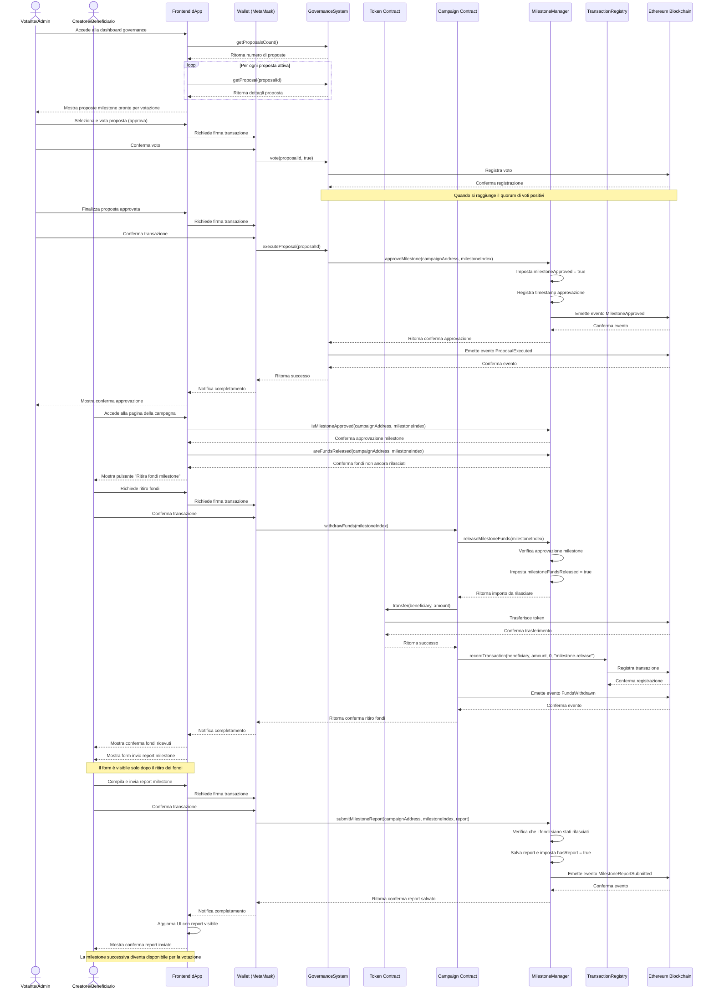
```mermaid
sequenceDiagram
    actor Voter as Votante/Admin
    actor Creator as Creatore/Beneficiario
    participant Frontend as Frontend dApp
    participant Wallet as Wallet (MetaMask)
    participant Governance as GovernanceSystem
    participant Token as Token Contract
    participant Campaign as Campaign Contract
    participant MManager as MilestoneManager
    participant Registry as TransactionRegistry
    participant Blockchain as Ethereum Blockchain
    
    %% Fase 1: Approvazione della milestone tramite sistema di governance
    Voter->>Frontend: Accede alla dashboard governance
    Frontend->>Governance: getProposalsCount()
    Governance-->>Frontend: Ritorna numero di proposte
    
    loop Per ogni proposta attiva
        Frontend->>Governance: getProposal(proposalId)
        Governance-->>Frontend: Ritorna dettagli proposta
    end
    
    Frontend-->>Voter: Mostra proposte milestone pronte per votazione
    Voter->>Frontend: Seleziona e vota proposta (approva)
    Frontend->>Wallet: Richiede firma transazione
    Voter->>Wallet: Conferma voto
    Wallet->>Governance: vote(proposalId, true)
    Governance->>Blockchain: Registra voto
    Blockchain-->>Governance: Conferma registrazione
    
    Note over Governance,Blockchain: Quando si raggiunge il quorum di voti positivi
    
    Voter->>Frontend: Finalizza proposta approvata
    Frontend->>Wallet: Richiede firma transazione
    Voter->>Wallet: Conferma transazione
    Wallet->>Governance: executeProposal(proposalId)
    Governance->>MManager: approveMilestone(campaignAddress, milestoneIndex)
    MManager->>MManager: Imposta milestoneApproved = true
    MManager->>MManager: Registra timestamp approvazione
    MManager->>Blockchain: Emette evento MilestoneApproved
    Blockchain-->>MManager: Conferma evento
    MManager-->>Governance: Ritorna conferma approvazione
    Governance->>Blockchain: Emette evento ProposalExecuted
    Blockchain-->>Governance: Conferma evento
    Governance-->>Wallet: Ritorna successo
    Wallet-->>Frontend: Notifica completamento
    Frontend-->>Voter: Mostra conferma approvazione
    
    %% Fase 2: Ritiro fondi da parte del beneficiario
    Creator->>Frontend: Accede alla pagina della campagna
    Frontend->>MManager: isMilestoneApproved(campaignAddress, milestoneIndex)
    MManager-->>Frontend: Conferma approvazione milestone
    Frontend->>MManager: areFundsReleased(campaignAddress, milestoneIndex)
    MManager-->>Frontend: Conferma fondi non ancora rilasciati
    
    Frontend-->>Creator: Mostra pulsante "Ritira fondi milestone"
    Creator->>Frontend: Richiede ritiro fondi
    Frontend->>Wallet: Richiede firma transazione
    Creator->>Wallet: Conferma transazione
    
    Wallet->>Campaign: withdrawFunds(milestoneIndex)
    Campaign->>MManager: releaseMilestoneFunds(milestoneIndex)
    MManager->>MManager: Verifica approvazione milestone
    MManager->>MManager: Imposta milestoneFundsReleased = true
    MManager-->>Campaign: Ritorna importo da rilasciare
    
    Campaign->>Token: transfer(beneficiary, amount)
    Token->>Blockchain: Trasferisce token
    Blockchain-->>Token: Conferma trasferimento
    Token-->>Campaign: Ritorna successo
    
    Campaign->>Registry: recordTransaction(beneficiary, amount, 0, "milestone-release")
    Registry->>Blockchain: Registra transazione
    Blockchain-->>Registry: Conferma registrazione
    
    Campaign->>Blockchain: Emette evento FundsWithdrawn
    Blockchain-->>Campaign: Conferma evento
    
    Campaign-->>Wallet: Ritorna conferma ritiro fondi
    Wallet-->>Frontend: Notifica completamento
    Frontend-->>Creator: Mostra conferma fondi ricevuti
    
    %% Fase 3: Invio report milestone
    Frontend-->>Creator: Mostra form invio report milestone
    Note over Frontend,Creator: Il form è visibile solo dopo il ritiro dei fondi
    
    Creator->>Frontend: Compila e invia report milestone
    Frontend->>Wallet: Richiede firma transazione
    Creator->>Wallet: Conferma transazione
    
    Wallet->>MManager: submitMilestoneReport(campaignAddress, milestoneIndex, report)
    MManager->>MManager: Verifica che i fondi siano stati rilasciati
    MManager->>MManager: Salva report e imposta hasReport = true
    MManager->>Blockchain: Emette evento MilestoneReportSubmitted
    Blockchain-->>MManager: Conferma evento
    
    MManager-->>Wallet: Ritorna conferma report salvato
    Wallet-->>Frontend: Notifica completamento
    Frontend->>Frontend: Aggiorna UI con report visibile
    Frontend-->>Creator: Mostra conferma report inviato
    
    Note over Creator,Frontend: La milestone successiva diventa disponibile per la votazione
```

## 10. Sequence Diagram per Rifiuto Milestone e Rimborso

Il seguente diagramma illustra il flusso completo del processo di rifiuto di una milestone e il conseguente rimborso dei fondi ai donatori, mostrando tutte le interazioni tra gli attori e i contratti coinvolti.

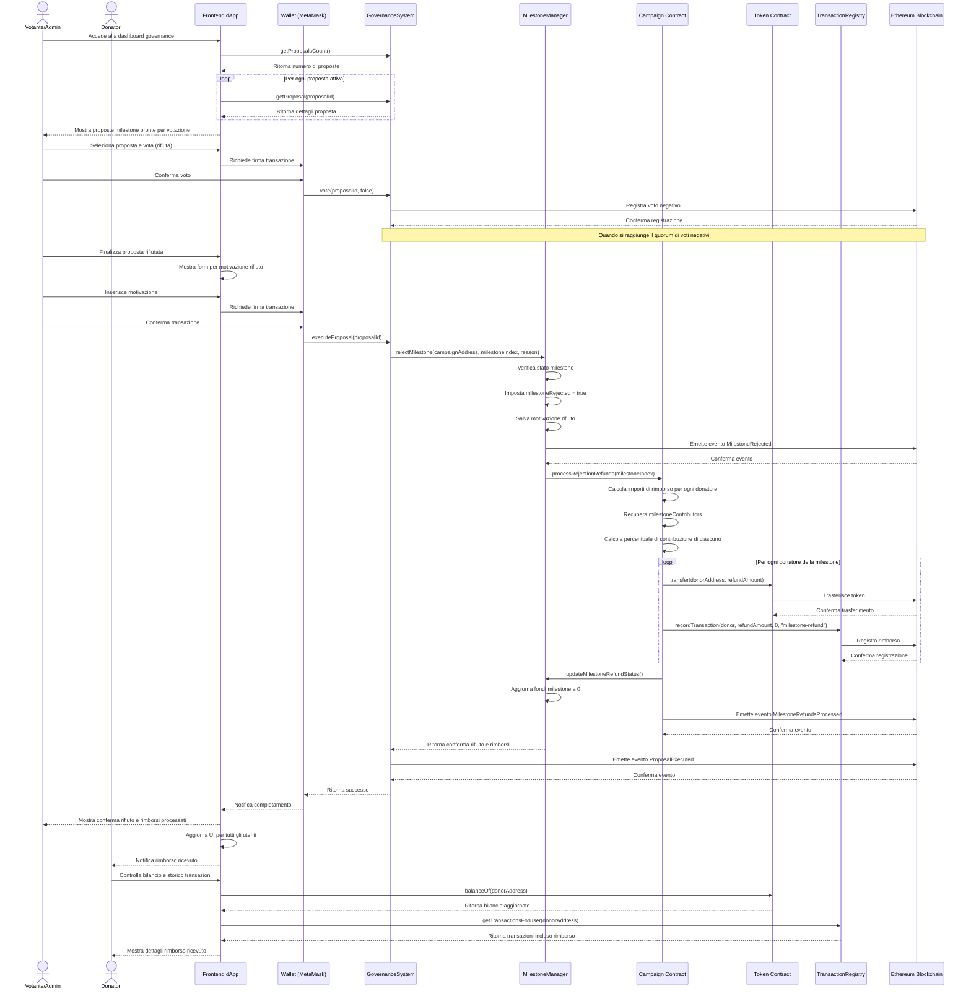
```mermaid
sequenceDiagram
    actor Voter as Votante/Admin
    actor Donor as Donatori
    participant Frontend as Frontend dApp
    participant Wallet as Wallet (MetaMask)
    participant Governance as GovernanceSystem
    participant MManager as MilestoneManager
    participant Campaign as Campaign Contract
    participant Token as Token Contract
    participant Registry as TransactionRegistry
    participant Blockchain as Ethereum Blockchain
    
    %% Fase 1: Votazione e rifiuto della milestone
    Voter->>Frontend: Accede alla dashboard governance
    Frontend->>Governance: getProposalsCount()
    Governance-->>Frontend: Ritorna numero di proposte
    
    loop Per ogni proposta attiva
        Frontend->>Governance: getProposal(proposalId)
        Governance-->>Frontend: Ritorna dettagli proposta
    end
    
    Frontend-->>Voter: Mostra proposte milestone pronte per votazione
    Voter->>Frontend: Seleziona proposta e vota (rifiuta)
    Frontend->>Wallet: Richiede firma transazione
    Voter->>Wallet: Conferma voto
    Wallet->>Governance: vote(proposalId, false)
    Governance->>Blockchain: Registra voto negativo
    Blockchain-->>Governance: Conferma registrazione
    
    Note over Governance,Blockchain: Quando si raggiunge il quorum di voti negativi
    
    Voter->>Frontend: Finalizza proposta rifiutata
    Frontend->>Frontend: Mostra form per motivazione rifiuto
    Voter->>Frontend: Inserisce motivazione
    Frontend->>Wallet: Richiede firma transazione
    Voter->>Wallet: Conferma transazione
    
    Wallet->>Governance: executeProposal(proposalId)
    Governance->>MManager: rejectMilestone(campaignAddress, milestoneIndex, reason)
    
    MManager->>MManager: Verifica stato milestone
    MManager->>MManager: Imposta milestoneRejected = true
    MManager->>MManager: Salva motivazione rifiuto
    MManager->>Blockchain: Emette evento MilestoneRejected
    Blockchain-->>MManager: Conferma evento
    
    %% Fase 2: Processo di rimborso automatico
    MManager->>Campaign: processRejectionRefunds(milestoneIndex)
    Campaign->>Campaign: Calcola importi di rimborso per ogni donatore
    
    %% Ottiene lista donatori per questa milestone
    Campaign->>Campaign: Recupera milestoneContributors
    Campaign->>Campaign: Calcola percentuale di contribuzione di ciascuno
    
    loop Per ogni donatore della milestone
        Campaign->>Token: transfer(donorAddress, refundAmount)
        Token->>Blockchain: Trasferisce token
        Blockchain-->>Token: Conferma trasferimento
        
        Campaign->>Registry: recordTransaction(donor, refundAmount, 0, "milestone-refund")
        Registry->>Blockchain: Registra rimborso
        Blockchain-->>Registry: Conferma registrazione
    end
    
    Campaign->>MManager: updateMilestoneRefundStatus()
    MManager->>MManager: Aggiorna fondi milestone a 0
    
    Campaign->>Blockchain: Emette evento MilestoneRefundsProcessed
    Blockchain-->>Campaign: Conferma evento
    
    MManager-->>Governance: Ritorna conferma rifiuto e rimborsi
    Governance->>Blockchain: Emette evento ProposalExecuted
    Blockchain-->>Governance: Conferma evento
    
    Governance-->>Wallet: Ritorna successo
    Wallet-->>Frontend: Notifica completamento
    Frontend-->>Voter: Mostra conferma rifiuto e rimborsi processati
    
    %% Fase 3: Notifica ai donatori
    Frontend->>Frontend: Aggiorna UI per tutti gli utenti
    Frontend-->>Donor: Notifica rimborso ricevuto
    
    %% Fase 4: Verifica rimborsi
    Donor->>Frontend: Controlla bilancio e storico transazioni
    Frontend->>Token: balanceOf(donorAddress)
    Token-->>Frontend: Ritorna bilancio aggiornato
    Frontend->>Registry: getTransactionsForUser(donorAddress)
    Registry-->>Frontend: Ritorna transazioni incluso rimborso
    Frontend-->>Donor: Mostra dettagli rimborso ricevuto
```

## 11. Sequence Diagram per Processo di Richiesta e Approvazione Creatori

Il seguente diagramma illustra il flusso completo del processo di richiesta e approvazione per ottenere lo status di creatore autorizzato nel sistema Donatio, mostrando tutte le interazioni tra gli attori e i contratti coinvolti.

```mermaid
sequenceDiagram
    actor User as Utente Standard
    actor Admin as Amministratore
    participant Frontend as Frontend dApp
    participant Wallet as Wallet (MetaMask)
    participant RequestMgr as CreatorRequestManager
    participant Factory as CampaignFactory
    participant Blockchain as Ethereum Blockchain
    
    %% Fase 1: Invio della richiesta da parte dell'utente
    User->>Frontend: Accede alla pagina "Diventa Creator"
    Frontend->>Frontend: Mostra form richiesta
    User->>Frontend: Compila form (descrizione, motivazioni, esperienze, ecc.)
    Frontend->>Frontend: Valida dati form
    
    Frontend->>Wallet: Richiede connessione wallet
    Wallet-->>User: Richiede autorizzazione
    User->>Wallet: Conferma connessione
    Wallet-->>Frontend: Ritorna indirizzo utente
    
    Frontend->>Wallet: Richiede firma transazione
    Wallet-->>User: Mostra dettagli transazione
    User->>Wallet: Conferma transazione
    
    Wallet->>RequestMgr: submitCreatorRequest(description)
    RequestMgr->>RequestMgr: Verifica che richiedente non abbia già una richiesta pendente
    RequestMgr->>RequestMgr: Crea nuova CreatorRequest { description, status=PENDING, timestamp }
    RequestMgr->>RequestMgr: Salva richiesta in creatorRequests[msg.sender]
    RequestMgr->>RequestMgr: Aggiunge indirizzo a pendingRequests[]
    
    RequestMgr->>Blockchain: Registra richiesta
    RequestMgr->>Blockchain: Emette evento CreatorRequestSubmitted
    Blockchain-->>RequestMgr: Conferma transazione
    
    RequestMgr-->>Wallet: Ritorna conferma
    Wallet-->>Frontend: Notifica completamento
    Frontend-->>User: Mostra conferma "Richiesta inviata con successo"
    Frontend-->>User: Aggiorna UI con stato richiesta "In attesa di revisione"
    
    %% Fase 2: Revisione delle richieste da parte dell'amministratore
    Admin->>Frontend: Accede alla dashboard amministrativa
    Frontend->>Wallet: Verifica se admin
    Wallet->>RequestMgr: isAdmin(address)
    RequestMgr-->>Frontend: Conferma status admin
    
    Frontend->>RequestMgr: getPendingRequestsCount()
    RequestMgr-->>Frontend: Ritorna numero richieste pendenti
    
    loop Per ogni richiesta pendente
        Frontend->>RequestMgr: getPendingRequestAtIndex(i)
        RequestMgr-->>Frontend: Ritorna indirizzo richiedente
        Frontend->>RequestMgr: getCreatorRequest(applicantAddress)
        RequestMgr-->>Frontend: Ritorna dettagli richiesta { description, status, timestamp }
        Frontend->>Frontend: Aggiunge richiesta alla lista visualizzata
    end
    
    Frontend-->>Admin: Mostra lista richieste pendenti con dettagli
    
    %% Fase 3: Decisione (approvazione o rifiuto)
    alt Approvazione della richiesta
        Admin->>Frontend: Seleziona "Approva" per una richiesta
        Frontend->>Wallet: Richiede firma transazione
        Wallet-->>Admin: Mostra dettagli transazione
        Admin->>Wallet: Conferma transazione
        
        Wallet->>RequestMgr: approveCreatorRequest(applicantAddress)
        RequestMgr->>RequestMgr: Verifica che richiedente esista
        RequestMgr->>RequestMgr: Verifica che status sia PENDING
        RequestMgr->>RequestMgr: Aggiorna status a APPROVED
        RequestMgr->>RequestMgr: Rimuove da pendingRequests[]
        RequestMgr->>RequestMgr: authorizeCreator(applicant, true)
        RequestMgr->>RequestMgr: Aggiorna authorizedCreators[applicant] = true
        
        RequestMgr->>Factory: Notifica approvazione nuovo creatore
        RequestMgr->>Blockchain: Emette evento CreatorRequestApproved
        Blockchain-->>RequestMgr: Conferma transazione
        
        RequestMgr-->>Wallet: Ritorna conferma
        Wallet-->>Frontend: Notifica completamento
        Frontend-->>Admin: Mostra conferma "Richiesta approvata con successo"
    else Rifiuto della richiesta
        Admin->>Frontend: Seleziona "Rifiuta" per una richiesta
        Frontend->>Frontend: Mostra campo per inserimento motivazione
        Admin->>Frontend: Inserisce motivazione del rifiuto
        Frontend->>Wallet: Richiede firma transazione
        Wallet-->>Admin: Mostra dettagli transazione
        Admin->>Wallet: Conferma transazione
        
        Wallet->>RequestMgr: rejectCreatorRequest(applicantAddress, reason)
        RequestMgr->>RequestMgr: Verifica che richiedente esista
        RequestMgr->>RequestMgr: Verifica che status sia PENDING
        RequestMgr->>RequestMgr: Aggiorna status a REJECTED
        RequestMgr->>RequestMgr: Salva motivazione rifiuto
        RequestMgr->>RequestMgr: Rimuove da pendingRequests[]
        
        RequestMgr->>Blockchain: Emette evento CreatorRequestRejected
        Blockchain-->>RequestMgr: Conferma transazione
        
        RequestMgr-->>Wallet: Ritorna conferma
        Wallet-->>Frontend: Notifica completamento
        Frontend-->>Admin: Mostra conferma "Richiesta rifiutata con successo"
    end
    
    %% Fase 4: Notifica e verifica dello stato da parte dell'utente
    User->>Frontend: Accede alla dashboard personale
    Frontend->>RequestMgr: getCreatorRequest(userAddress)
    RequestMgr-->>Frontend: Ritorna dettagli richiesta aggiornati
    
    alt Richiesta approvata
        Frontend-->>User: Mostra "Congratulazioni! Sei ora un creatore autorizzato"
        Frontend-->>User: Sblocca funzionalità di creazione campagne
    else Richiesta rifiutata
        Frontend-->>User: Mostra "La tua richiesta è stata rifiutata" con motivazione
        Frontend-->>User: Offre la possibilità di inviare una nuova richiesta
    else Richiesta in attesa
        Frontend-->>User: Mostra "La tua richiesta è in fase di revisione"
    end
```

## 12. Sequence Diagram per Creazione e Votazione Proposta

Il seguente diagramma illustra il flusso completo del processo di creazione e votazione di una proposta nel sistema di governance di Donatio, dalla sottomissione iniziale fino alla determinazione dell'esito.

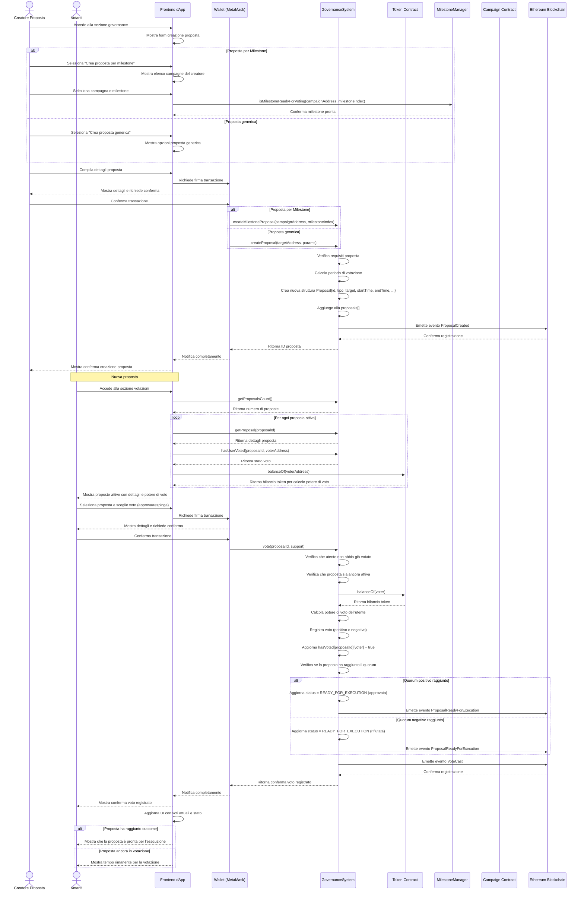
```mermaid
sequenceDiagram
    actor Proposer as Creatore Proposta
    actor Voters as Votanti
    participant Frontend as Frontend dApp
    participant Wallet as Wallet (MetaMask)
    participant Governance as GovernanceSystem
    participant Token as Token Contract
    participant MManager as MilestoneManager
    participant Campaign as Campaign Contract
    participant Blockchain as Ethereum Blockchain
    
    %% Fase 1: Creazione della proposta
    Proposer->>Frontend: Accede alla sezione governance
    Frontend->>Frontend: Mostra form creazione proposta
    
    alt Proposta per Milestone
        Proposer->>Frontend: Seleziona "Crea proposta per milestone"
        Frontend->>Frontend: Mostra elenco campagne del creatore
        Proposer->>Frontend: Seleziona campagna e milestone
        Frontend->>MManager: isMilestoneReadyForVoting(campaignAddress, milestoneIndex)
        MManager-->>Frontend: Conferma milestone pronta
    else Proposta generica
        Proposer->>Frontend: Seleziona "Crea proposta generica"
        Frontend->>Frontend: Mostra opzioni proposta generica
    end
    
    Proposer->>Frontend: Compila dettagli proposta
    Frontend->>Wallet: Richiede firma transazione
    Wallet-->>Proposer: Mostra dettagli e richiede conferma
    Proposer->>Wallet: Conferma transazione
    
    alt Proposta per Milestone
        Wallet->>Governance: createMilestoneProposal(campaignAddress, milestoneIndex)
    else Proposta generica
        Wallet->>Governance: createProposal(targetAddress, params)
    end
    
    Governance->>Governance: Verifica requisiti proposta
    Governance->>Governance: Calcola periodo di votazione
    Governance->>Governance: Crea nuova struttura Proposal{id, tipo, target, startTime, endTime, ...}
    Governance->>Governance: Aggiunge alla proposals[]
    
    Governance->>Blockchain: Emette evento ProposalCreated
    Blockchain-->>Governance: Conferma registrazione
    
    Governance-->>Wallet: Ritorna ID proposta
    Wallet-->>Frontend: Notifica completamento
    Frontend-->>Proposer: Mostra conferma creazione proposta
    
    %% Fase 2: Inizio periodo di votazione
    Note over Frontend,Voters: Nuova proposta
    
    %% Fase 3: Processo di votazione
    Voters->>Frontend: Accede alla sezione votazioni
    Frontend->>Governance: getProposalsCount()
    Governance-->>Frontend: Ritorna numero di proposte
    
    loop Per ogni proposta attiva
        Frontend->>Governance: getProposal(proposalId)
        Governance-->>Frontend: Ritorna dettagli proposta
        
        Frontend->>Governance: hasUserVoted(proposalId, voterAddress)
        Governance-->>Frontend: Ritorna stato voto
        
        Frontend->>Token: balanceOf(voterAddress)
        Token-->>Frontend: Ritorna bilancio token per calcolo potere di voto
    end
    
    Frontend-->>Voters: Mostra proposte attive con dettagli e potere di voto
    
    Voters->>Frontend: Seleziona proposta e sceglie voto (approva/respinge)
    Frontend->>Wallet: Richiede firma transazione
    Wallet-->>Voters: Mostra dettagli e richiede conferma
    Voters->>Wallet: Conferma transazione
    
    Wallet->>Governance: vote(proposalId, support)
    Governance->>Governance: Verifica che utente non abbia già votato
    Governance->>Governance: Verifica che proposta sia ancora attiva
    
    Governance->>Token: balanceOf(voter)
    Token-->>Governance: Ritorna bilancio token
    
    Governance->>Governance: Calcola potere di voto dell'utente
    Governance->>Governance: Registra voto (positivo o negativo)
    Governance->>Governance: Aggiorna hasVoted[proposalId][voter] = true
    
    Governance->>Governance: Verifica se la proposta ha raggiunto il quorum
    
    alt Quorum positivo raggiunto
        Governance->>Governance: Aggiorna status = READY_FOR_EXECUTION (approvata)
        Governance->>Blockchain: Emette evento ProposalReadyForExecution
    else Quorum negativo raggiunto
        Governance->>Governance: Aggiorna status = READY_FOR_EXECUTION (rifiutata)
        Governance->>Blockchain: Emette evento ProposalReadyForExecution
    end
    
    Governance->>Blockchain: Emette evento VoteCast
    Blockchain-->>Governance: Conferma registrazione
    
    Governance-->>Wallet: Ritorna conferma voto registrato
    Wallet-->>Frontend: Notifica completamento
    Frontend-->>Voters: Mostra conferma voto registrato
    
    %% Fase 4: Aggiornamento stato proposta
    Frontend->>Frontend: Aggiorna UI con voti attuali e stato
    
    alt Proposta ha raggiunto outcome
        Frontend-->>Voters: Mostra che la proposta è pronta per l'esecuzione
    else Proposta ancora in votazione
        Frontend-->>Voters: Mostra tempo rimanente per la votazione
    end
```

## 13. State Diagram per Ciclo di Vita Campagna

Il seguente diagramma illustra i diversi stati in cui può trovarsi una campagna di raccolta fondi durante il suo ciclo di vita all'interno del sistema Donatio, mostrando le transizioni e i trigger che provocano i cambiamenti di stato.

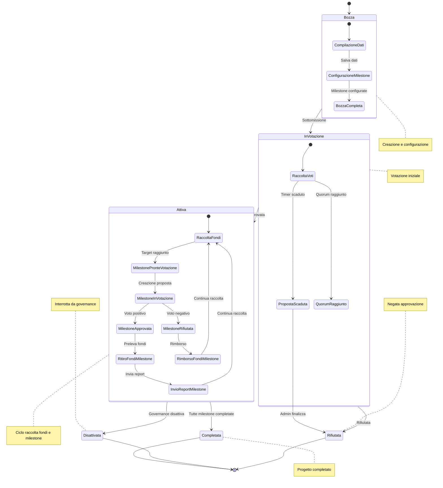
```mermaid
%%{init: { 'themeCSS': 'svg { max-height: 700px; max-width: 900px; }', 'flowchart': {'diagramPadding': 50, 'nodeSpacing': 20, 'rankSpacing': 40, 'curve': 'basis'}}}%%
stateDiagram-v2
    direction TB
    
    [*] --> Bozza
    
    state Bozza {
        direction TB
        [*] --> CompilazioneDati
        CompilazioneDati --> ConfigurazioneMilestone: Salva dati
        ConfigurazioneMilestone --> BozzaCompleta: Milestone configurate
    }
    
    Bozza --> InVotazione: Sottomissione
    
    state InVotazione {
        direction TB
        [*] --> RaccoltaVoti
        RaccoltaVoti --> PropostaScaduta: Timer scaduto
        RaccoltaVoti --> QuorumRaggiunto: Quorum raggiunto
    }
    
    InVotazione --> Attiva: Approvata
    InVotazione --> Rifiutata: Rifiutata
    PropostaScaduta --> Rifiutata: Admin finalizza
    
    state Attiva {
        direction TB
        [*] --> RaccoltaFondi
        
        RaccoltaFondi --> MilestonePronteVotazione: Target raggiunto
        MilestonePronteVotazione --> MilestoneInVotazione: Creazione proposta
        
        MilestoneInVotazione --> MilestoneApprovata: Voto positivo
        MilestoneInVotazione --> MilestoneRifiutata: Voto negativo
        
        MilestoneApprovata --> RitiroFondiMilestone: Preleva fondi
        MilestoneRifiutata --> RimborsoFondiMilestone: Rimborso
        
        RitiroFondiMilestone --> InvioReportMilestone: Invia report
        
        RimborsoFondiMilestone --> RaccoltaFondi: Continua raccolta
        InvioReportMilestone --> RaccoltaFondi: Continua raccolta
    }
    
    Attiva --> Completata: Tutte milestone completate
    Attiva --> Disattivata: Governance disattiva
    
    Completata --> [*]
    Disattivata --> [*]
    Rifiutata --> [*]
    
    note right of Bozza: Creazione e configurazione
    note right of InVotazione: Votazione iniziale
    note right of Attiva: Ciclo raccolta fondi e milestone
    note right of Completata: Progetto completato
    note left of Rifiutata: Negata approvazione
    note left of Disattivata: Interrotta da governance
```

## 14. State Diagram per Ciclo di Vita Milestone

Il seguente diagramma illustra i diversi stati in cui può trovarsi una milestone durante il suo ciclo di vita all'interno del sistema Donatio, evidenziando le transizioni e i trigger che provocano i cambiamenti di stato.

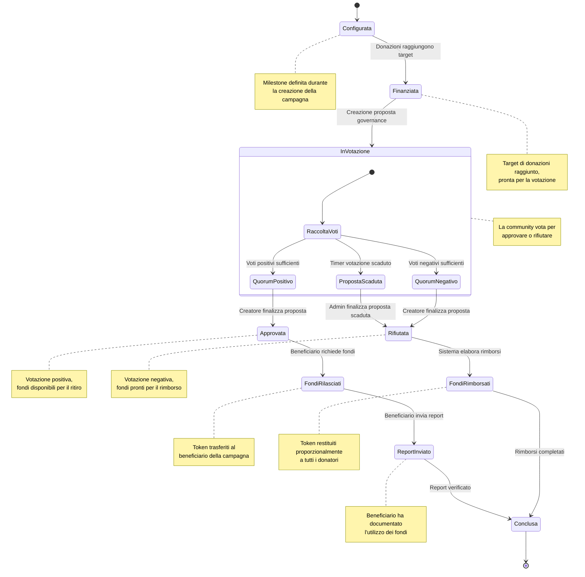
```mermaid
%%{init: { 'themeCSS': 'svg { max-height: 600px; max-width: 850px; }', 'flowchart': {'diagramPadding': 30, 'nodeSpacing': 30, 'rankSpacing': 40, 'curve': 'basis'}}}%%
stateDiagram-v2
    direction TB
    
    [*] --> Configurata
    
    Configurata --> Finanziata: Donazioni raggiungono target
    
    Finanziata --> InVotazione: Creazione proposta governance
    
    state InVotazione {
        direction TB
        [*] --> RaccoltaVoti
        RaccoltaVoti --> QuorumPositivo: Voti positivi sufficienti
        RaccoltaVoti --> QuorumNegativo: Voti negativi sufficienti
        RaccoltaVoti --> PropostaScaduta: Timer votazione scaduto
    }
    
    QuorumPositivo --> Approvata: Creatore finalizza proposta
    QuorumNegativo --> Rifiutata: Creatore finalizza proposta
    PropostaScaduta --> Rifiutata: Admin finalizza proposta scaduta
    
    Approvata --> FondiRilasciati: Beneficiario richiede fondi
    Rifiutata --> FondiRimborsati: Sistema elabora rimborsi
    
    FondiRilasciati --> ReportInviato: Beneficiario invia report
    FondiRimborsati --> Conclusa: Rimborsi completati
    ReportInviato --> Conclusa: Report verificato
    
    Conclusa --> [*]
    
    note right of Configurata
        Milestone definita durante
        la creazione della campagna
    end note
    
    note right of Finanziata
        Target di donazioni raggiunto,
        pronta per la votazione
    end note
    
    note right of InVotazione
        La community vota per
        approvare o rifiutare
    end note
    
    note right of Approvata
        Votazione positiva,
        fondi disponibili per il ritiro
    end note
    
    note right of Rifiutata
        Votazione negativa,
        fondi pronti per il rimborso
    end note
    
    note right of FondiRilasciati
        Token trasferiti al
        beneficiario della campagna
    end note
    
    note right of FondiRimborsati
        Token restituiti proporzionalmente
        a tutti i donatori
    end note
    
    note right of ReportInviato
        Beneficiario ha documentato
        l'utilizzo dei fondi
    end note
```

## 15. State Diagram per Ciclo di Vita Proposta Governance

Il seguente diagramma illustra i diversi stati in cui può trovarsi una proposta di governance durante il suo ciclo di vita all'interno del sistema Donatio, evidenziando le transizioni e i trigger che provocano i cambiamenti di stato.

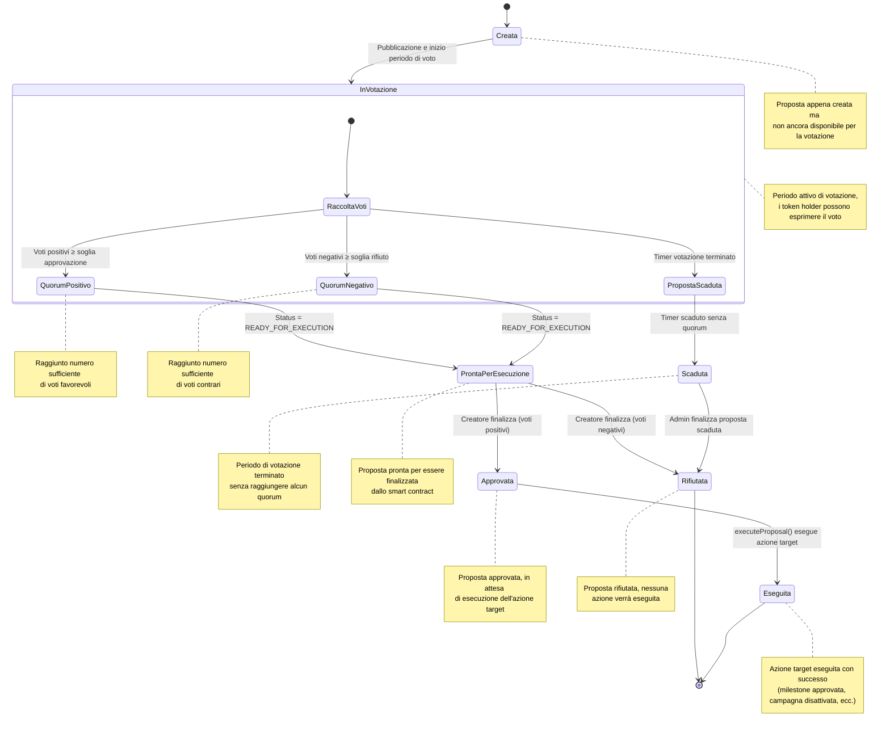
```mermaid
%%{init: { 'themeCSS': 'svg { max-height: 600px; max-width: 850px; }', 'flowchart': {'diagramPadding': 30, 'nodeSpacing': 30, 'rankSpacing': 40, 'curve': 'basis'}}}%%
stateDiagram-v2
    direction TB
    
    [*] --> Creata
    
    Creata --> InVotazione: Pubblicazione e inizio periodo di voto
    
    state InVotazione {
        direction TB
        [*] --> RaccoltaVoti
        RaccoltaVoti --> QuorumPositivo: Voti positivi ≥ soglia approvazione
        RaccoltaVoti --> QuorumNegativo: Voti negativi ≥ soglia rifiuto
        RaccoltaVoti --> PropostaScaduta: Timer votazione terminato
    }
    
    QuorumPositivo --> ProntaPerEsecuzione: Status = READY_FOR_EXECUTION
    QuorumNegativo --> ProntaPerEsecuzione: Status = READY_FOR_EXECUTION
    PropostaScaduta --> Scaduta: Timer scaduto senza quorum
    
    ProntaPerEsecuzione --> Approvata: Creatore finalizza (voti positivi)
    ProntaPerEsecuzione --> Rifiutata: Creatore finalizza (voti negativi)
    Scaduta --> Rifiutata: Admin finalizza proposta scaduta
    
    Approvata --> Eseguita: executeProposal() esegue azione target
    Rifiutata --> [*]
    Eseguita --> [*]
    
    note right of Creata
        Proposta appena creata ma 
        non ancora disponibile per la votazione
    end note
    
    note right of InVotazione
        Periodo attivo di votazione,
        i token holder possono esprimere il voto
    end note
    
    note right of QuorumPositivo
        Raggiunto numero sufficiente 
        di voti favorevoli
    end note
    
    note right of QuorumNegativo
        Raggiunto numero sufficiente 
        di voti contrari
    end note
    
    note right of Scaduta
        Periodo di votazione terminato
        senza raggiungere alcun quorum
    end note
    
    note right of ProntaPerEsecuzione
        Proposta pronta per essere finalizzata
        dallo smart contract
    end note
    
    note right of Approvata
        Proposta approvata, in attesa 
        di esecuzione dell'azione target
    end note
    
    note right of Rifiutata
        Proposta rifiutata, nessuna
        azione verrà eseguita
    end note
    
    note right of Eseguita
        Azione target eseguita con successo
        (milestone approvata, campagna disattivata, ecc.)
    end note
```
## 16. Activity Diagram per Flusso dei Fondi

Il seguente diagramma illustra il percorso completo dei token DNT dall'origine fino alla distribuzione finale nel sistema Donatio, mostrando tutti i possibili flussi di valore e le interazioni tra i vari componenti.

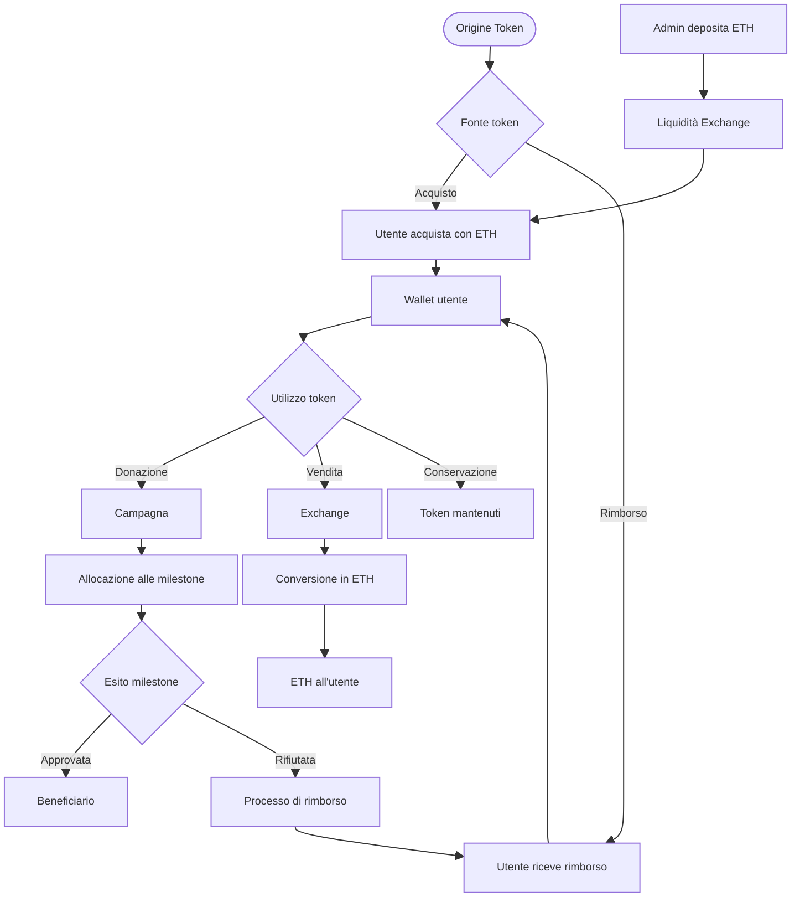
```mermaid
%%{init: { 
  'themeVariables': {'fontSize': '10px'},
  'flowchart': {'diagramPadding': 4, 'nodeSpacing': 5, 'rankSpacing': 15, 'curve': 'basis'},
  'themeCSS': 'svg { transform: scale(0.6); transform-origin: top left; }',
  'fit': true
}}%%
flowchart TD
    start([Origine Token]) --> token_source{Fonte token}
    
    %% Percorsi di acquisizione token
    token_source -->|Acquisto| buy[Utente acquista con ETH]
    token_source -->|Rimborso| refund[Utente riceve rimborso]
    
    buy --> user_wallet[Wallet utente]
    refund --> user_wallet
    
    %% Percorsi di utilizzo
    user_wallet --> token_use{Utilizzo token}
    
    %% Donazione
    token_use -->|Donazione| campaign[Campagna]
    campaign --> milestone_allocation[Allocazione alle milestone]
    
    %% Decisione milestone (semplificata)
    milestone_allocation --> milestone_outcome{Esito milestone}
    
    %% Percorsi dopo decisione
    milestone_outcome -->|Approvata| beneficiary[Beneficiario]
    milestone_outcome -->|Rifiutata| refund_process[Processo di rimborso]
    refund_process --> refund
    
    %% Vendita token
    token_use -->|Vendita| sell[Exchange]
    sell --> eth_conversion[Conversione in ETH]
    
    %% Possibilità di trattenere
    token_use -->|Conservazione| hold[Token mantenuti]
    
    %% Admin deposito ETH
    admin_deposit[Admin deposita ETH] --> exchange_liquidity[Liquidità Exchange]
    exchange_liquidity --> buy
    eth_conversion --> user_eth[ETH all'utente]
```

## 17. Activity Diagram per Processo Decisionale Governance

Il seguente diagramma illustra il workflow completo del processo decisionale nel sistema di governance di Donatio, dalla creazione della proposta fino alla sua esecuzione o rifiuto.

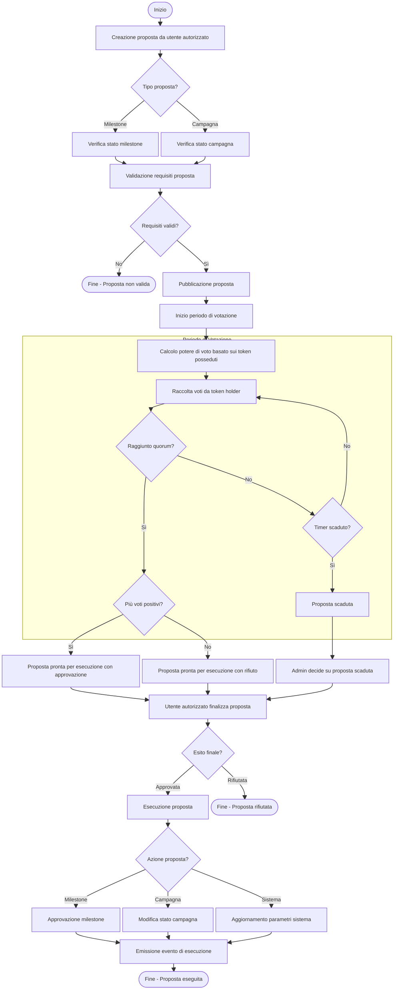
```mermaid
%%{init: { 
  'themeVariables': {'fontSize': '10px'},
  'flowchart': {'diagramPadding': 4, 'nodeSpacing': 5, 'rankSpacing': 15, 'curve': 'basis'},
  'themeCSS': 'svg { transform: scale(0.6); transform-origin: top left; }',
  'fit': true
}}%%
flowchart TD
    start([Inizio]) --> prop_creation[Creazione proposta da utente autorizzato]
    prop_creation --> prop_type{Tipo proposta?}
    
    %% Tipi di proposta
    prop_type -->|Milestone| milestone_check[Verifica stato milestone]
    prop_type -->|Campagna| campaign_check[Verifica stato campagna]
    
    milestone_check --> validation
    campaign_check --> validation
    
    %% Validazione proposta
    validation[Validazione requisiti proposta] --> valid{Requisiti validi?}
    valid -->|No| invalid_end([Fine - Proposta non valida])
    valid -->|Sì| publish[Pubblicazione proposta]
    
    %% Periodo di votazione
    publish --> voting_period[Inizio periodo di votazione] 
    voting_period --> token_calc[Calcolo potere di voto basato sui token posseduti]
    
    subgraph "Periodo di Votazione"
        token_calc --> voting[Raccolta voti da token holder]
        voting --> quorum_check{Raggiunto quorum?}
        quorum_check -->|No| timer_check{Timer scaduto?}
        timer_check -->|No| voting
        timer_check -->|Sì| expired[Proposta scaduta]
        quorum_check -->|Sì| outcome_check{Più voti positivi?}
    end
    
    %% Esiti della votazione
    outcome_check -->|Sì| ready_positive[Proposta pronta per esecuzione con approvazione]
    outcome_check -->|No| ready_negative[Proposta pronta per esecuzione con rifiuto]
    expired --> admin_action[Admin decide su proposta scaduta]
    
    %% Finalizzazione
    ready_positive --> finalize[Utente autorizzato finalizza proposta]
    ready_negative --> finalize
    admin_action --> finalize
    
    finalize --> finalize_check{Esito finale?}
    
    %% Esecuzione proposta
    finalize_check -->|Approvata| execute[Esecuzione proposta]
    finalize_check -->|Rifiutata| reject_end([Fine - Proposta rifiutata])
    
    execute --> action_type{Azione proposta?}
    
    %% Azioni specifiche
    action_type -->|Milestone| milestone_action[Approvazione milestone]
    action_type -->|Campagna| campaign_action[Modifica stato campagna]
    action_type -->|Sistema| system_action[Aggiornamento parametri sistema]
    
    milestone_action --> emit_event
    campaign_action --> emit_event
    system_action --> emit_event
    
    %% Conclusione
    emit_event[Emissione evento di esecuzione] --> success_end([Fine - Proposta eseguita])
```

## 18. Entity-Relationship Diagram per Strutture Dati

Il seguente diagramma illustra le principali entità del sistema Donatio, le loro relazioni e le strutture dati fondamentali memorizzate sulla blockchain.

```mermaid
erDiagram
    %% Entità principali
    USER {
        address wallet PK
        uint256 tokenBalance
        bool isAdmin
        bool isCreator
    }

    TOKEN {
        string name
        string symbol
        uint8 decimals
        uint256 totalSupply
        mapping balances
        mapping allowances
    }

    TOKENEXCHANGE {
        address owner
        uint256 rate
        uint256 ethBalance
    }

    TRANSACTIONREGISTRY {
        mapping authorizedContracts
    }
    
    TRANSACTION {
        address user FK
        uint256 tokenAmount
        uint256 ethAmount
        uint256 timestamp
        string txType
    }

    CAMPAIGNFACTORY {
        address[] campaigns
        mapping creatorToCampaigns
    }

    CAMPAIGN {
        address id PK
        string title
        string description
        string detailedDescription
        address beneficiary
        address creator FK
        uint256 goalAmount
        uint256 raisedAmount
        string mainImageCID
        string[] additionalImagesCIDs
        bool active
        bool milestonesConfigured
    }
    
    DONATION {
        address donor FK
        uint256 amount
        string message
        uint256 timestamp
        uint milestoneIndex
    }

    MILESTONEMANAGER {
        mapping campaignMilestones
    }
    
    MILESTONE {
        string title
        string description
        uint256 targetAmount
        uint256 raisedAmount
        bool approved
        bool rejected
        bool fundsReleased
        uint256 approvedAt
        string report
        string rejectionReason
    }

    GOVERNANCESYSTEM {
        address admin
        uint256 votingPeriod
        Proposal[] proposals
    }
    
    PROPOSAL {
        uint256 id PK
        enum proposalType
        address target
        uint256 startTime
        uint256 endTime
        uint256 forVotes
        uint256 againstVotes
        bool executed
        enum status
        mapping hasVoted
    }
    
    CREATORREQUESTMANAGER {
        mapping creatorRequests
        mapping authorizedCreators
        address[] pendingRequests
    }
    
    CREATORREQUEST {
        address applicant PK
        string description
        enum status
        uint256 timestamp
        string rejectionReason
    }

    %% Relazioni one-to-many
    USER ||--o{ DONATION : "effettua"
    USER ||--o{ TRANSACTION : "ha"
    USER ||--o{ CAMPAIGN : "crea"
    USER ||--o{ CREATORREQUEST : "invia"
    USER }o--o{ PROPOSAL : "vota"
    
    TOKEN ||--|| TOKENEXCHANGE : "scambiato tramite"
    TOKEN ||--o{ TRANSACTION : "trasferisce"
    
    CAMPAIGN ||--o{ DONATION : "riceve"
    CAMPAIGN ||--o{ MILESTONE : "suddivisa in"
    CAMPAIGN }|--|| USER : "beneficiario"
    
    TRANSACTIONREGISTRY ||--o{ TRANSACTION : "registra"
    
    %% Relazioni many-to-many
    MILESTONE }o--o{ PROPOSAL : "approvata tramite"

    %% Relazioni gerarchiche
    CAMPAIGNFACTORY ||--o{ CAMPAIGN : "crea"
    MILESTONEMANAGER ||--o{ MILESTONE : "gestisce"
    GOVERNANCESYSTEM ||--o{ PROPOSAL : "contiene"
    CREATORREQUESTMANAGER ||--o{ CREATORREQUEST : "gestisce"
    
    %% Relazioni di dipendenza
    TOKENEXCHANGE }|--|| TRANSACTIONREGISTRY : "usa"
    CAMPAIGN }|--|| TOKEN : "usa"
    CAMPAIGN }|--|| TRANSACTIONREGISTRY : "usa"
    CAMPAIGN }|--|| MILESTONEMANAGER : "usa"
    GOVERNANCESYSTEM }|--|| TOKEN : "usa per calcolo voti"
    GOVERNANCESYSTEM }|--|| CAMPAIGNFACTORY : "interagisce"
    CAMPAIGNFACTORY }|--|| TOKEN : "usa"
    CAMPAIGNFACTORY }|--|| TRANSACTIONREGISTRY : "usa"
    CAMPAIGNFACTORY }|--|| CREATORREQUESTMANAGER : "verifica"
    CAMPAIGNFACTORY }|--|| MILESTONEMANAGER : "configura"
```

## 19. Diagram di Sicurezza

Il seguente diagramma illustra l'architettura di sicurezza del sistema Donatio, evidenziando i principali punti di protezione, il modello di autorizzazione e le salvaguardie implementate contro gli attacchi noti.

```mermaid
mindmap
  root((Sicurezza<br>Sistema))
    Manipolazione Transazioni
      ::icon(fa fa-exchange)
      Front-running
        Operazioni vulnerabili
          Transazioni token
          Votazione governance
        Protezioni implementate
          ::icon(fa fa-shield)
          Timelock per operazioni critiche
          Rate limiting
    
    Vulnerabilità Logica Contratti
      ::icon(fa fa-code)
      Reentrancy
        Operazioni vulnerabili
          Rilascio fondi milestone
          Chiamate a contratti esterni
        Protezioni implementate
          ::icon(fa fa-shield)
          Pattern Checks-Effects-Interactions
          Mutex (blocco di rientro)
    
    Vulnerabilità Aritmetiche
      ::icon(fa fa-calculator)
      Integer Overflow/Underflow
        Operazioni vulnerabili
          Calcolo importi token
          Distribuzione fondi milestone
        Protezioni implementate
          ::icon(fa fa-shield)
          SafeMath / Solidity 0.8+
          Validazione input
    
    Controllo Accessi
      ::icon(fa fa-lock)
      Access Control Bypass
        Operazioni vulnerabili
          Gestione autorizzazioni
          Amministrazione contratti
        Protezioni implementate
          ::icon(fa fa-shield)
          Modificatori di accesso
          Verifica ruoli onlyAdmin/onlyCreator
    
    Modello Autorizzazioni
      ::icon(fa fa-users)
      Admin
        Operazioni consentite
          Upgrade contratti
          Gestione parametri sistema
          Finalizzazione proposte scadute
      Creator
        Operazioni consentite
          Creazione campagne
          Configurazione milestone
          Ritiro fondi approvati
      Donatore
        Operazioni consentite
          Votazione proposte
          Donazione token
      Utente base
        Operazioni consentite
          Visualizzazione campagne
          Acquisto/vendita token
```

## 20. Deployment Diagram

Il seguente diagramma illustra l'architettura di deployment del sistema Donatio, mostrando come i vari componenti vengono distribuiti e interagiscono tra loro nell'ambiente di sviluppo e di test.

```mermaid
flowchart TB
    %% Livello Client
    subgraph "Ambiente Client"
        Browser["Browser Web"]
        MetaMask["Wallet MetaMask"]
        Browser <--> MetaMask
    end
    
    %% Livello Frontend
    subgraph "Frontend (Localhost)"
        ReactApp["React App"]
        WebpackServer["Webpack Dev Server (porta 3000)"]
        WebServices["Web3 Services"]
        
        ReactApp <--> WebpackServer
        ReactApp <--> WebServices
        Browser <--> WebpackServer
    end
    
    %% Livello Blockchain semplificato
    subgraph "Blockchain Layer"
        HardhatNode["Hardhat Network (porta 8545)"]
        
        subgraph "Smart Contracts"
            Token["Token Contract"]
            MainContracts["Core Contracts"]
        end
        
        HardhatNode --- Token
        HardhatNode --- MainContracts
    end
    
    %% Servizi Esterni
    subgraph "Servizi Esterni"
        IPFS["IPFS/Pinata"]
    end
    
    %% Connessioni tra livelli
    WebServices <--> HardhatNode
    WebServices <--> IPFS
    MetaMask <--> HardhatNode
    
    %% Deployment Tools semplificato
    subgraph "Strumenti di Deployment"
        DeployScripts["Script di Deployment"]
        DeployScripts --> HardhatNode
        DeployScripts --> WebServices
    end
```

## 1. slides

```mermaid
flowchart TD
    Users["Utenti"] --> WebApp["React dApp"]
    WebApp <--> MetaMask["MetaMask"] & SmartContracts["Smart Contracts"] & IPFS["IPFS"]
    MetaMask <--> Ethereum["Ethereum"]
    SmartContracts --- Ethereum
    
    classDef userStyle fill:transparent,stroke:#FFFFFF,stroke-width:2px,color:#FFFFFF;
    classDef frontendStyle fill:transparent,stroke:#FFFFFF,stroke-width:2px,color:#FFFFFF;
    classDef blockchainStyle fill:transparent,stroke:#FFFFFF,stroke-width:2px,color:#FFFFFF;
    classDef storageStyle fill:transparent,stroke:#FFFFFF,stroke-width:2px,color:#FFFFFF;
    
    class Users userStyle;
    class WebApp,MetaMask frontendStyle;
    class SmartContracts,Ethereum blockchainStyle;
    class IPFS storageStyle;
```

## 2. slides

```mermaid
flowchart LR
    %% Attori
    Visitatore((VISITATORE))
    Utente((UTENTE))
    Creator((CREATOR))
    Admin((ADMIN))
    
    %% Funzionalità essenziali
    VisualizzaCampagne[VISUALIZZA CAMPAGNE]
    ConnettiWallet[CONNETTI WALLET]
    AcquistaToken[ACQUISTA TOKEN]
    DonaFondi[DONA FONDI]
    VotaMilestone[VOTA MILESTONE]
    CreaCampagna[CREA CAMPAGNA]
    GestisceMilestone[GESTISCE MILESTONE]
    ApprovaCreator[APPROVA CREATOR]
    
    %% Collegamenti diretti
    Visitatore --- VisualizzaCampagne
    Visitatore --- ConnettiWallet
    
    Utente --- AcquistaToken
    Utente --- DonaFondi
    Utente --- VotaMilestone
    
    Creator --- CreaCampagna
    Creator --- GestisceMilestone
    
    Admin --- ApprovaCreator
    
    %% Styling minimalista
    classDef default fill:transparent,stroke:#FFFFFF,stroke-width:2px,color:#FFFFFF;
```

## 3. slides

```mermaid
flowchart RL
    TOKEN[TOKEN]
    TOKENEXCHANGE[TOKEN EXCHANGE]
    CAMPAIGNFACTORY[CAMPAIGN FACTORY]
    CAMPAIGN[CAMPAIGN]
    GOVERNANCESYSTEM[GOVERNANCE SYSTEM]
    TRANSACTIONREGISTRY[TRANSACTION REGISTRY]
    CREATORREQUESTMANAGER[CREATOR REQUEST MANAGER]
    MILESTONEMANAGER[MILESTONE MANAGER]
    
    %% Ogni contratto ha la sua relazione principale
    TOKENEXCHANGE <--> TOKEN
    
    CAMPAIGNFACTORY --> CAMPAIGN
    CAMPAIGNFACTORY --> TOKEN
    CAMPAIGNFACTORY --> CREATORREQUESTMANAGER
    
    CAMPAIGN --> TOKEN
    CAMPAIGN <--> GOVERNANCESYSTEM
    CAMPAIGN --> TRANSACTIONREGISTRY
    
    GOVERNANCESYSTEM --> TOKEN
    
    MILESTONEMANAGER --> CAMPAIGN
```

## 4. slides

```mermaid
flowchart LR
    Frontend[REACT + WEB3.JS] --> MetaMask[METAMASK WALLET]
    Frontend --> Blockchain[HARDHAT NETWORK]
    Frontend --> Storage[PINATA IPFS]
    
    Blockchain --> Contracts[SMART CONTRACTS SOLIDIY]
    MetaMask --> Blockchain
```