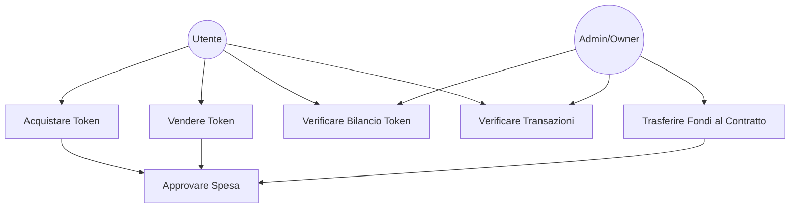
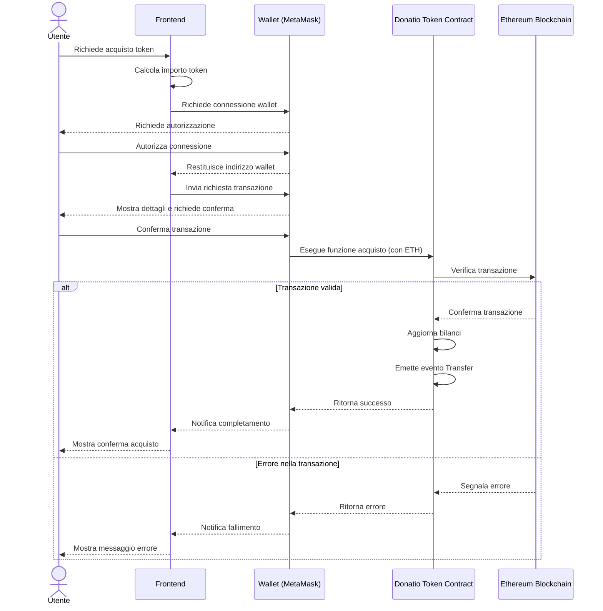

## Use Case Diagram

```mermaid
graph TD
    %% Attori
    User((Utente))
    Admin((Admin/Owner))
    
    %% Casi d'uso principali
    BuyTokens[Acquistare Token]
    SellTokens[Vendere Token]
    CheckBalance[Verificare Bilancio Token]
    ApproveSpending[Approvare Spesa]
    LookTransactions[Verificare Transazioni]
    
    %% Casi d'uso amministrativi
    Withdraw[Trasferire Fondi al Contratto]
    
    %% Connessioni utente
    User --> BuyTokens
    User --> SellTokens
    User --> CheckBalance
    BuyTokens --> ApproveSpending
    SellTokens --> ApproveSpending
    User --> LookTransactions
    
    %% Connessioni admin
    Admin --> Withdraw
    Admin --> CheckBalance
    Admin --> LookTransactions
    Withdraw --> ApproveSpending
```

## Sequence Diagram per Acquisto Token

```mermaid
sequenceDiagram
    actor User as Utente
    participant Frontend
    participant Wallet as Wallet (MetaMask)
    participant Contract as Donatio Token Contract
    participant Blockchain as Ethereum Blockchain
    
    User->>Frontend: Richiede acquisto token
    Frontend->>Frontend: Calcola importo token
    Frontend->>Wallet: Richiede connessione wallet
    Wallet-->>User: Richiede autorizzazione
    User->>Wallet: Autorizza connessione
    Wallet-->>Frontend: Restituisce indirizzo wallet
    
    Frontend->>Wallet: Invia richiesta transazione
    Wallet-->>User: Mostra dettagli e richiede conferma
    User->>Wallet: Conferma transazione
    Wallet->>Contract: Esegue funzione acquisto (con ETH)
    Contract->>Blockchain: Verifica transazione
    
    alt Transazione valida
        Blockchain-->>Contract: Conferma transazione
        Contract->>Contract: Aggiorna bilanci
        Contract->>Contract: Emette evento Transfer
        Contract-->>Wallet: Ritorna successo
        Wallet-->>Frontend: Notifica completamento
        Frontend-->>User: Mostra conferma acquisto
    else Errore nella transazione
        Blockchain-->>Contract: Segnala errore
        Contract-->>Wallet: Ritorna errore
        Wallet-->>Frontend: Notifica fallimento
        Frontend-->>User: Mostra messaggio errore
    end
```